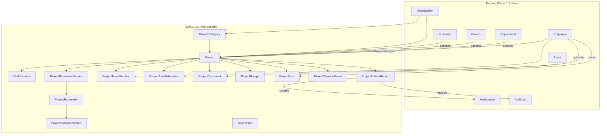

# Design Document

**Specification ID:** SPEC-001
**Title:** Project Workspace Module
**Workflow:** Requirements-First
**Status:** Draft

---

## 1. Overview

The Project Workspace module transforms a project record into a fully contextualized operational
workspace within NexAsset. It is the first Phase 2 module and must integrate with all existing
Phase 1 entities (Organization, Branch, Department, Employee, Asset, Customer, Notification,
AuditLog) without breaking any existing behaviour.

### Design Goals

- Industry-agnostic: no hardcoded vertical-specific fields — dynamic parameters solve this
- Fully multi-tenant: all entities scoped by OrganizationId via EF Core HasQueryFilter
- Clean Architecture + CQRS compliance throughout
- Extensible by design: nullable FK hooks, reserved enum values, reserved extension points
- Zero breaking changes to existing modules

### Scope of New Entities (13 domain entities + 1 support entity)

| # | Entity | Purpose |
|---|--------|---------|
| 1 | `ProjectCategory` | Org-scoped project classification label |
| 2 | `Project` | Core entity — the workspace root |
| 3 | `DraftSession` | Temporary wizard state persistence |
| 4 | `ProjectParameterSection` | Named grouping of dynamic fields |
| 5 | `ProjectParameter` | Field definition (name, type, unit, required, order) |
| 6 | `ProjectParameterValue` | Actual value per field per project |
| 7 | `ProjectTeamMember` | Employee assignment with role and allocation |
| 8 | `ProjectAssetAllocation` | Asset binding with quantity and status |
| 9 | `ProjectDocument` | File attachment with versioning |
| 10 | `ProjectBudget` | Append-only budget snapshot history |
| 11 | `ProjectRisk` | Risk register entry |
| 12 | `ProjectTimelineEvent` | Immutable chronological event log |
| 13 | `ProjectActivityRecord` | Detailed activity feed entry |
| + | `SavedFilter` | User-saved search/filter combination |


---

## 2. Architecture

### Layer Responsibility Map

```
┌─────────────────────────────────────────────────────────────────┐
│  NexAsset.Web (Blazor WASM)                                     │
│  Features/Projects/  — pages, components, typed API clients     │
└───────────────────────────┬─────────────────────────────────────┘
                            │ HTTP (cookie auth)
┌───────────────────────────▼─────────────────────────────────────┐
│  NexAsset.API                                                   │
│  Endpoints/Projects/  — thin Minimal API adapters               │
│  Endpoints/ProjectCategories/                                   │
└───────────────────────────┬─────────────────────────────────────┘
                            │ MediatR.Send()
┌───────────────────────────▼─────────────────────────────────────┐
│  NexAsset.Application                                           │
│  Features/Projects/Commands|Queries/                            │
│  Features/ProjectCategories/Commands|Queries/                   │
│  ValidationBehavior pipeline (FluentValidation)                 │
└───────────────┬───────────────────────────────┬─────────────────┘
                │ domain entities                │ repository interfaces
┌───────────────▼───────────┐  ┌─────────────────▼───────────────┐
│  NexAsset.Domain          │  │  NexAsset.Infrastructure        │
│  Entities/Project*.cs     │  │  Repository/Project*.cs         │
│  Entities/DraftSession.cs │  │  Persistence/Configurations/    │
│  Enums/ProjectEnums.cs    │  │  Project*Configuration.cs       │
└───────────────────────────┘  └────────────────┬────────────────┘
                                                 │ EF Core 10
                                        ┌────────▼──────────┐
                                        │   PostgreSQL       │
                                        └───────────────────┘
```

### Middleware Stack (unchanged, no new middleware)

```
GlobalExceptionMiddleware → UseHttpsRedirection → UseCors
→ UseAuthentication → UseAuthorization
→ TenantResolutionMiddleware → Endpoints
```

### Module Interaction Diagram




---

## 3. Domain Model

### 3.1 Enums — `Domain/Enums/ProjectEnums.cs`

```csharp
namespace NexAsset.Domain.Enums;

public enum ProjectStatus
{
    Draft = 1,
    Planning = 2,
    AwaitingApproval = 3,
    Approved = 4,
    InProgress = 5,
    OnHold = 6,
    Completed = 7,
    Archived = 8,
    Cancelled = 9
}

public enum ProjectPriority
{
    Low = 1,
    Medium = 2,
    High = 3,
    Critical = 4
}

public enum ParameterInputType
{
    Text = 1,
    Textarea = 2,
    Number = 3,
    Decimal = 4,
    Date = 5,
    Dropdown = 6,
    Checkbox = 7,
    Email = 8,
    Phone = 9,
    URL = 10
}

public enum TeamMemberStatus
{
    Active = 1,
    Released = 2
}

public enum AllocationStatus
{
    Active = 1,
    Returned = 2,
    PartiallyReturned = 3
}

public enum DocumentCategory
{
    Agreement = 1,
    Contract = 2,
    Survey = 3,
    BOQ = 4,
    TechnicalDrawing = 5,
    GovernmentApproval = 6,
    InspectionReport = 7,
    CompletionCertificate = 8,
    Invoice = 9,
    PurchaseDocument = 10,
    Photo = 11,
    Video = 12,
    Other = 13
}

public enum RiskCategory
{
    Technical = 1,
    Financial = 2,
    Operational = 3,
    External = 4,
    Regulatory = 5,
    Safety = 6,
    Resource = 7
}

public enum RiskProbability { Low = 1, Medium = 2, High = 3 }
public enum RiskImpact     { Low = 1, Medium = 2, High = 3 }
public enum RiskSeverity   { Low = 1, Medium = 2, High = 3, Critical = 4 }

public enum RiskStatus
{
    Open = 1,
    InProgress = 2,
    Mitigated = 3,
    Closed = 4
}

public enum TimelineEventType
{
    ProjectCreated = 1,
    PlanningStarted = 2,
    ApprovalRequested = 3,
    Approved = 4,
    TeamMemberAdded = 5,
    TeamMemberReleased = 6,
    AssetAllocated = 7,
    AssetReturned = 8,
    DocumentUploaded = 9,
    DocumentReplaced = 10,
    DocumentDeleted = 11,
    BudgetUpdated = 12,
    RiskAdded = 13,
    RiskClosed = 14,
    ParameterCreated = 15,
    ParameterUpdated = 16,
    ParameterDeleted = 17,
    ProjectCompleted = 18,
    ProjectArchived = 19,
    // Reserved for future modules — DO NOT REMOVE
    TaskCreated = 100,
    TaskCompleted = 101,
    MilestoneReached = 102,
    GanttUpdated = 103,
    IssueOpened = 104,
    IssueClosed = 105,
    MeetingScheduled = 106,
    ProgressReportSubmitted = 107,
    RFIDScanRecorded = 108,
    IoTDataReceived = 109,
    AIRecommendationGenerated = 110
}

public enum ActivityType
{
    ProjectCreated = 1,
    ProjectUpdated = 2,
    StatusChanged = 3,
    PriorityChanged = 4,
    EmployeeAdded = 5,
    EmployeeReleased = 6,
    AssetAllocated = 7,
    AssetReturned = 8,
    DocumentUploaded = 9,
    DocumentReplaced = 10,
    DocumentDeleted = 11,
    ParameterCreated = 12,
    ParameterUpdated = 13,
    ParameterDeleted = 14,
    SectionCreated = 15,
    SectionDeleted = 16,
    BudgetUpdated = 17,
    RiskAdded = 18,
    RiskUpdated = 19,
    RiskClosed = 20
}

public enum NotificationPriority
{
    Info = 1,
    Warning = 2,
    Critical = 3
}

public enum ProjectNotificationType
{
    ProjectAssigned = 1,
    ApprovalRequested = 2,
    ApprovalCompleted = 3,
    TeamMemberAdded = 4,
    TeamMemberReleased = 5,
    AssetAllocated = 6,
    AssetReturned = 7,
    BudgetThresholdCrossed = 8,
    RiskCreated = 9,
    RiskCritical = 10,
    RiskClosed = 11,
    DocumentUploaded = 12,
    DocumentExpiring = 13,
    UpcomingDeadline = 14,
    ProjectCompleted = 15
}
```


### 3.2 Entity Definitions

All entities inherit `BaseEntity` which provides:
```
Id (Guid, PK)  CreatedAtUtc (DateTime UTC)  UpdatedAtUtc (DateTime UTC)
IsDeleted (bool)  DeletedAtUtc (DateTime?)
```

#### ProjectCategory — `Domain/Entities/ProjectCategory.cs`
```csharp
public class ProjectCategory : BaseEntity
{
    public string Name { get; set; } = default!;           // MaxLength(100), unique per org
    public string? Description { get; set; }               // MaxLength(500)
    public bool IsActive { get; set; } = true;

    public Guid OrganizationId { get; set; }
    public Organization Organization { get; set; } = default!;
}
```

#### Project — `Domain/Entities/Project.cs`
```csharp
public class Project : BaseEntity
{
    public string ProjectCode { get; set; } = default!;    // MaxLength(50), unique per org
    public string ProjectName { get; set; } = default!;    // MaxLength(200)
    public string? Description { get; set; }               // MaxLength(1000)
    public string? Notes { get; set; }                     // MaxLength(2000)
    public string? InternalRemarks { get; set; }           // MaxLength(2000)
    public ProjectStatus Status { get; set; } = ProjectStatus.Draft;
    public ProjectPriority Priority { get; set; } = ProjectPriority.Medium;
    public DateOnly? StartDate { get; set; }
    public DateOnly? EndDate { get; set; }
    public DateOnly? ExpectedCompletionDate { get; set; }

    public Guid OrganizationId { get; set; }
    public Organization Organization { get; set; } = default!;

    public Guid? CustomerId { get; set; }
    public Customer? Customer { get; set; }

    public Guid CategoryId { get; set; }
    public ProjectCategory Category { get; set; } = default!;

    public Guid? BranchId { get; set; }
    public Branch? Branch { get; set; }

    public Guid? DepartmentId { get; set; }
    public Department? Department { get; set; }

    public Guid? ProjectManagerEmployeeId { get; set; }
    public Employee? ProjectManager { get; set; }

    // Extension points for future modules (nullable FKs — no migration impact)
    public Guid? TaskModuleId { get; set; }      // Future: Task Management
    public Guid? MilestoneModuleId { get; set; } // Future: Milestones
}
```

#### DraftSession — `Domain/Entities/DraftSession.cs`
```csharp
public class DraftSession : BaseEntity
{
    public Guid UserId { get; set; }
    public Guid OrganizationId { get; set; }
    public string WizardStateJson { get; set; } = default!; // Full wizard state serialized as JSON
    public int CurrentStep { get; set; } = 1;               // 1-7
    public DateTime LastSavedAtUtc { get; set; } = DateTime.UtcNow;
}
```

#### ProjectParameterSection — `Domain/Entities/ProjectParameterSection.cs`
```csharp
public class ProjectParameterSection : BaseEntity
{
    public string Name { get; set; } = default!; // MaxLength(100)
    public int DisplayOrder { get; set; }

    public Guid ProjectId { get; set; }
    public Project Project { get; set; } = default!;

    public ICollection<ProjectParameter> Parameters { get; set; } = new List<ProjectParameter>();
}
```

#### ProjectParameter — `Domain/Entities/ProjectParameter.cs`
```csharp
public class ProjectParameter : BaseEntity
{
    public string ParameterName { get; set; } = default!;  // MaxLength(100)
    public ParameterInputType InputType { get; set; }
    public string? Unit { get; set; }                       // MaxLength(50)
    public bool IsRequired { get; set; }
    public int DisplayOrder { get; set; }
    public string? DropdownOptionsJson { get; set; }        // JSON array of strings (only for Dropdown type)

    public Guid SectionId { get; set; }
    public ProjectParameterSection Section { get; set; } = default!;
}
```

#### ProjectParameterValue — `Domain/Entities/ProjectParameterValue.cs`
```csharp
public class ProjectParameterValue : BaseEntity
{
    public string? Value { get; set; } // MaxLength(2000)

    public Guid ProjectId { get; set; }
    public Project Project { get; set; } = default!;

    public Guid ParameterId { get; set; }
    public ProjectParameter Parameter { get; set; } = default!;
}
```

#### ProjectTeamMember — `Domain/Entities/ProjectTeamMember.cs`
```csharp
public class ProjectTeamMember : BaseEntity
{
    public string ProjectRole { get; set; } = default!; // MaxLength(100)
    public int AllocationPercentage { get; set; }       // 1-100
    public DateOnly JoinedDate { get; set; }
    public DateOnly? ReleasedDate { get; set; }
    public TeamMemberStatus Status { get; set; } = TeamMemberStatus.Active;
    public string? Remarks { get; set; }                // MaxLength(500)

    // Snapshots (captured at time of assignment — not updated if employee changes)
    public Guid? SnapshotBranchId { get; set; }
    public Guid? SnapshotDepartmentId { get; set; }

    public Guid ProjectId { get; set; }
    public Project Project { get; set; } = default!;

    public Guid EmployeeId { get; set; }
    public Employee Employee { get; set; } = default!;
}
```


#### ProjectAssetAllocation — `Domain/Entities/ProjectAssetAllocation.cs`
```csharp
public class ProjectAssetAllocation : BaseEntity
{
    public DateOnly AllocationDate { get; set; }
    public DateOnly? ReturnDate { get; set; }
    public int AllocatedQuantity { get; set; }   // > 0
    public int ReturnedQuantity { get; set; }    // >= 0
    public AllocationStatus Status { get; set; } = AllocationStatus.Active;
    public string? Remarks { get; set; }         // MaxLength(500)

    public Guid ProjectId { get; set; }
    public Project Project { get; set; } = default!;

    public Guid AssetId { get; set; }
    public Asset Asset { get; set; } = default!;
}
```

#### ProjectDocument — `Domain/Entities/ProjectDocument.cs`
```csharp
public class ProjectDocument : BaseEntity
{
    public string DocumentName { get; set; } = default!; // MaxLength(200)
    public DocumentCategory Category { get; set; }
    public string? Description { get; set; }             // MaxLength(500)
    public string FileReference { get; set; } = default!; // stored path/URL, MaxLength(1000)
    public DateTime UploadedAtUtc { get; set; } = DateTime.UtcNow;
    public int Version { get; set; } = 1;
    public string? Remarks { get; set; }                 // MaxLength(500)
    public DateOnly? ExpiryDate { get; set; }            // For future expiry notifications

    public Guid ProjectId { get; set; }
    public Project Project { get; set; } = default!;

    public Guid? UploadedByEmployeeId { get; set; }
    public Employee? UploadedByEmployee { get; set; }
}
```

#### ProjectBudget — `Domain/Entities/ProjectBudget.cs`

Append-only: never UPDATE a row; INSERT a new version on every change.
```csharp
public class ProjectBudget : BaseEntity
{
    public decimal EstimatedBudget { get; set; }     // >= 0, decimal(18,2)
    public decimal ApprovedBudget { get; set; }      // >= 0, decimal(18,2)
    public decimal ActualCost { get; set; }          // >= 0, decimal(18,2)
    public decimal ProcurementCost { get; set; }     // >= 0, decimal(18,2)
    public decimal MaintenanceCost { get; set; }     // >= 0, decimal(18,2)
    public decimal LabourCost { get; set; }          // >= 0, decimal(18,2)
    public decimal MiscellaneousCost { get; set; }   // >= 0, decimal(18,2)
    public Guid UpdatedByUserId { get; set; }        // Who made this version
    // Computed (in-memory, not stored):
    // RemainingBudget = ApprovedBudget - ActualCost
    // BudgetPercentageUsed = ApprovedBudget > 0 ? (ActualCost / ApprovedBudget) * 100 : 0
    // BudgetStatus = Under/On/Over Budget

    public Guid ProjectId { get; set; }
    public Project Project { get; set; } = default!;

    // Extension point: Finance module integration (nullable FK)
    public Guid? FinanceInvoiceId { get; set; }
}
```

#### ProjectRisk — `Domain/Entities/ProjectRisk.cs`
```csharp
public class ProjectRisk : BaseEntity
{
    public string Title { get; set; } = default!;        // MaxLength(200)
    public string? Description { get; set; }             // MaxLength(1000)
    public RiskCategory Category { get; set; }
    public RiskProbability Probability { get; set; }
    public RiskImpact Impact { get; set; }
    public RiskSeverity Severity { get; set; }           // Computed — see matrix
    public RiskStatus Status { get; set; } = RiskStatus.Open;
    public string? MitigationPlan { get; set; }          // MaxLength(1000)
    public string? Remarks { get; set; }                 // MaxLength(500)
    public DateTime? ClosedAtUtc { get; set; }

    public Guid ProjectId { get; set; }
    public Project Project { get; set; } = default!;

    public Guid? OwnerEmployeeId { get; set; }
    public Employee? OwnerEmployee { get; set; }
}
```

#### ProjectTimelineEvent — `Domain/Entities/ProjectTimelineEvent.cs`

Immutable — never updated after insert.
```csharp
public class ProjectTimelineEvent : BaseEntity
{
    public TimelineEventType EventType { get; set; }
    public string EntityType { get; set; } = default!;   // MaxLength(100)
    public Guid? EntityId { get; set; }
    public string Description { get; set; } = default!;  // MaxLength(500)
    public DateTime Timestamp { get; set; } = DateTime.UtcNow;
    public Guid? UserId { get; set; }
    public string IconType { get; set; } = default!;     // MaxLength(50) — CSS icon class

    public Guid ProjectId { get; set; }
    public Project Project { get; set; } = default!;
}
```

#### ProjectActivityRecord — `Domain/Entities/ProjectActivityRecord.cs`

Immutable — never updated after insert.
```csharp
public class ProjectActivityRecord : BaseEntity
{
    public ActivityType ActivityType { get; set; }
    public Guid? UserId { get; set; }
    public string Action { get; set; } = default!;       // MaxLength(500) — human-readable past-tense
    public string TargetEntity { get; set; } = default!; // MaxLength(100) — entity type name
    public Guid? TargetEntityId { get; set; }
    public DateTime Timestamp { get; set; } = DateTime.UtcNow;
    public string? Remarks { get; set; }                 // MaxLength(500)

    public Guid ProjectId { get; set; }
    public Project Project { get; set; } = default!;
}
```

#### SavedFilter — `Domain/Entities/SavedFilter.cs`
```csharp
public class SavedFilter : BaseEntity
{
    public string FilterName { get; set; } = default!;   // MaxLength(100)
    public string EntityType { get; set; } = default!;   // MaxLength(100) e.g. "Project", "Risk"
    public string? SearchKeyword { get; set; }           // MaxLength(200)
    public string FilterCriteriaJson { get; set; } = default!; // JSON object of filter fields

    public Guid UserId { get; set; }                     // ApplicationUser.Id
    public Guid OrganizationId { get; set; }
    public Organization Organization { get; set; } = default!;
}
```

### 3.3 Risk Severity Computation

```csharp
public static RiskSeverity ComputeSeverity(RiskProbability p, RiskImpact i) => (p, i) switch
{
    (RiskProbability.Low,    RiskImpact.Low)    => RiskSeverity.Low,
    (RiskProbability.Low,    RiskImpact.Medium) => RiskSeverity.Low,
    (RiskProbability.Low,    RiskImpact.High)   => RiskSeverity.Medium,
    (RiskProbability.Medium, RiskImpact.Low)    => RiskSeverity.Low,
    (RiskProbability.Medium, RiskImpact.Medium) => RiskSeverity.Medium,
    (RiskProbability.Medium, RiskImpact.High)   => RiskSeverity.High,
    (RiskProbability.High,   RiskImpact.Low)    => RiskSeverity.Medium,
    (RiskProbability.High,   RiskImpact.Medium) => RiskSeverity.High,
    (RiskProbability.High,   RiskImpact.High)   => RiskSeverity.Critical,
    _ => RiskSeverity.Low
};
```

### 3.4 Project Status Transition Guard

```csharp
private static readonly IReadOnlyDictionary<ProjectStatus, HashSet<ProjectStatus>> AllowedTransitions =
    new Dictionary<ProjectStatus, HashSet<ProjectStatus>>
    {
        [ProjectStatus.Draft]             = new() { ProjectStatus.Planning },
        [ProjectStatus.Planning]          = new() { ProjectStatus.AwaitingApproval, ProjectStatus.Cancelled },
        [ProjectStatus.AwaitingApproval]  = new() { ProjectStatus.Approved, ProjectStatus.Planning, ProjectStatus.Cancelled },
        [ProjectStatus.Approved]          = new() { ProjectStatus.InProgress, ProjectStatus.Cancelled },
        [ProjectStatus.InProgress]        = new() { ProjectStatus.OnHold, ProjectStatus.Completed, ProjectStatus.Cancelled },
        [ProjectStatus.OnHold]            = new() { ProjectStatus.InProgress, ProjectStatus.Cancelled },
        [ProjectStatus.Completed]         = new() { ProjectStatus.Archived },
        [ProjectStatus.Archived]          = new() { ProjectStatus.InProgress },
        [ProjectStatus.Cancelled]         = new HashSet<ProjectStatus>()
    };

public static bool IsAllowed(ProjectStatus from, ProjectStatus to) =>
    AllowedTransitions.TryGetValue(from, out var allowed) && allowed.Contains(to);
```


---

## 4. Database Design

### 4.1 Table Schemas

#### ProjectCategories
| Column | Type | Constraints |
|--------|------|-------------|
| Id | uuid | PK |
| OrganizationId | uuid | FK → Organizations, Restrict |
| Name | varchar(100) | NOT NULL |
| Description | varchar(500) | NULL |
| IsActive | bool | NOT NULL DEFAULT true |
| CreatedAtUtc | timestamp | NOT NULL |
| UpdatedAtUtc | timestamp | NOT NULL |
| IsDeleted | bool | NOT NULL DEFAULT false |
| DeletedAtUtc | timestamp | NULL |

Indexes: `UNIQUE (OrganizationId, Name) WHERE IsDeleted = false`

#### Projects
| Column | Type | Constraints |
|--------|------|-------------|
| Id | uuid | PK |
| OrganizationId | uuid | FK → Organizations, Restrict |
| ProjectCode | varchar(50) | NOT NULL |
| ProjectName | varchar(200) | NOT NULL |
| Description | varchar(1000) | NULL |
| Notes | varchar(2000) | NULL |
| InternalRemarks | varchar(2000) | NULL |
| Status | int | NOT NULL |
| Priority | int | NOT NULL |
| StartDate | date | NULL |
| EndDate | date | NULL |
| ExpectedCompletionDate | date | NULL |
| CustomerId | uuid | FK → Customers, Restrict, NULL |
| CategoryId | uuid | FK → ProjectCategories, Restrict |
| BranchId | uuid | FK → Branches, Restrict, NULL |
| DepartmentId | uuid | FK → Departments, Restrict, NULL |
| ProjectManagerEmployeeId | uuid | FK → Employees, Restrict, NULL |
| TaskModuleId | uuid | NULL (extension point) |
| MilestoneModuleId | uuid | NULL (extension point) |
| CreatedAtUtc | timestamp | NOT NULL |
| UpdatedAtUtc | timestamp | NOT NULL |
| IsDeleted | bool | NOT NULL DEFAULT false |
| DeletedAtUtc | timestamp | NULL |

Indexes:
- `UNIQUE (OrganizationId, ProjectCode) WHERE IsDeleted = false`
- `INDEX (OrganizationId, Status)`
- `INDEX (ProjectManagerEmployeeId)`
- `INDEX (CategoryId)`

#### DraftSessions
| Column | Type | Constraints |
|--------|------|-------------|
| Id | uuid | PK |
| UserId | uuid | NOT NULL |
| OrganizationId | uuid | NOT NULL |
| WizardStateJson | text | NOT NULL |
| CurrentStep | int | NOT NULL DEFAULT 1 |
| LastSavedAtUtc | timestamp | NOT NULL |
| CreatedAtUtc | timestamp | NOT NULL |
| UpdatedAtUtc | timestamp | NOT NULL |
| IsDeleted | bool | NOT NULL DEFAULT false |
| DeletedAtUtc | timestamp | NULL |

Indexes: `INDEX (UserId, OrganizationId) WHERE IsDeleted = false`

#### ProjectParameterSections
| Column | Type | Constraints |
|--------|------|-------------|
| Id | uuid | PK |
| ProjectId | uuid | FK → Projects, Restrict |
| Name | varchar(100) | NOT NULL |
| DisplayOrder | int | NOT NULL |
| CreatedAtUtc | timestamp | NOT NULL |
| UpdatedAtUtc | timestamp | NOT NULL |
| IsDeleted | bool | NOT NULL DEFAULT false |
| DeletedAtUtc | timestamp | NULL |

Index: `INDEX (ProjectId)`

#### ProjectParameters
| Column | Type | Constraints |
|--------|------|-------------|
| Id | uuid | PK |
| SectionId | uuid | FK → ProjectParameterSections, Restrict |
| ParameterName | varchar(100) | NOT NULL |
| InputType | int | NOT NULL |
| Unit | varchar(50) | NULL |
| IsRequired | bool | NOT NULL DEFAULT false |
| DisplayOrder | int | NOT NULL |
| DropdownOptionsJson | text | NULL |
| CreatedAtUtc | timestamp | NOT NULL |
| UpdatedAtUtc | timestamp | NOT NULL |
| IsDeleted | bool | NOT NULL DEFAULT false |
| DeletedAtUtc | timestamp | NULL |

Index: `INDEX (SectionId)`

#### ProjectParameterValues
| Column | Type | Constraints |
|--------|------|-------------|
| Id | uuid | PK |
| ProjectId | uuid | FK → Projects, Restrict |
| ParameterId | uuid | FK → ProjectParameters, Restrict |
| Value | varchar(2000) | NULL |
| CreatedAtUtc | timestamp | NOT NULL |
| UpdatedAtUtc | timestamp | NOT NULL |
| IsDeleted | bool | NOT NULL DEFAULT false |
| DeletedAtUtc | timestamp | NULL |

Indexes: `UNIQUE (ProjectId, ParameterId) WHERE IsDeleted = false`

#### ProjectTeamMembers
| Column | Type | Constraints |
|--------|------|-------------|
| Id | uuid | PK |
| ProjectId | uuid | FK → Projects, Restrict |
| EmployeeId | uuid | FK → Employees, Restrict |
| ProjectRole | varchar(100) | NOT NULL |
| AllocationPercentage | int | NOT NULL CHECK (1..100) |
| JoinedDate | date | NOT NULL |
| ReleasedDate | date | NULL |
| Status | int | NOT NULL |
| Remarks | varchar(500) | NULL |
| SnapshotBranchId | uuid | NULL |
| SnapshotDepartmentId | uuid | NULL |
| CreatedAtUtc | timestamp | NOT NULL |
| UpdatedAtUtc | timestamp | NOT NULL |
| IsDeleted | bool | NOT NULL DEFAULT false |
| DeletedAtUtc | timestamp | NULL |

Indexes:
- `INDEX (ProjectId, Status)`
- `INDEX (EmployeeId)`

#### ProjectAssetAllocations
| Column | Type | Constraints |
|--------|------|-------------|
| Id | uuid | PK |
| ProjectId | uuid | FK → Projects, Restrict |
| AssetId | uuid | FK → Assets, Restrict |
| AllocationDate | date | NOT NULL |
| ReturnDate | date | NULL |
| AllocatedQuantity | int | NOT NULL CHECK > 0 |
| ReturnedQuantity | int | NOT NULL DEFAULT 0 |
| Status | int | NOT NULL |
| Remarks | varchar(500) | NULL |
| CreatedAtUtc | timestamp | NOT NULL |
| UpdatedAtUtc | timestamp | NOT NULL |
| IsDeleted | bool | NOT NULL DEFAULT false |
| DeletedAtUtc | timestamp | NULL |

Indexes:
- `INDEX (ProjectId, Status)`
- `INDEX (AssetId)`

#### ProjectDocuments
| Column | Type | Constraints |
|--------|------|-------------|
| Id | uuid | PK |
| ProjectId | uuid | FK → Projects, Restrict |
| UploadedByEmployeeId | uuid | FK → Employees, Restrict, NULL |
| DocumentName | varchar(200) | NOT NULL |
| Category | int | NOT NULL |
| Description | varchar(500) | NULL |
| FileReference | varchar(1000) | NOT NULL |
| UploadedAtUtc | timestamp | NOT NULL |
| Version | int | NOT NULL DEFAULT 1 |
| Remarks | varchar(500) | NULL |
| ExpiryDate | date | NULL |
| CreatedAtUtc | timestamp | NOT NULL |
| UpdatedAtUtc | timestamp | NOT NULL |
| IsDeleted | bool | NOT NULL DEFAULT false |
| DeletedAtUtc | timestamp | NULL |

Indexes: `INDEX (ProjectId, Category)`


#### ProjectBudgets
| Column | Type | Constraints |
|--------|------|-------------|
| Id | uuid | PK |
| ProjectId | uuid | FK → Projects, Restrict |
| EstimatedBudget | decimal(18,2) | NOT NULL DEFAULT 0 |
| ApprovedBudget | decimal(18,2) | NOT NULL DEFAULT 0 |
| ActualCost | decimal(18,2) | NOT NULL DEFAULT 0 |
| ProcurementCost | decimal(18,2) | NOT NULL DEFAULT 0 |
| MaintenanceCost | decimal(18,2) | NOT NULL DEFAULT 0 |
| LabourCost | decimal(18,2) | NOT NULL DEFAULT 0 |
| MiscellaneousCost | decimal(18,2) | NOT NULL DEFAULT 0 |
| UpdatedByUserId | uuid | NOT NULL |
| FinanceInvoiceId | uuid | NULL (extension) |
| CreatedAtUtc | timestamp | NOT NULL |
| UpdatedAtUtc | timestamp | NOT NULL |
| IsDeleted | bool | NOT NULL DEFAULT false |
| DeletedAtUtc | timestamp | NULL |

Index: `INDEX (ProjectId, CreatedAtUtc DESC)` — latest version first

#### ProjectRisks
| Column | Type | Constraints |
|--------|------|-------------|
| Id | uuid | PK |
| ProjectId | uuid | FK → Projects, Restrict |
| OwnerEmployeeId | uuid | FK → Employees, Restrict, NULL |
| Title | varchar(200) | NOT NULL |
| Description | varchar(1000) | NULL |
| Category | int | NOT NULL |
| Probability | int | NOT NULL |
| Impact | int | NOT NULL |
| Severity | int | NOT NULL (computed and stored) |
| Status | int | NOT NULL |
| MitigationPlan | varchar(1000) | NULL |
| Remarks | varchar(500) | NULL |
| ClosedAtUtc | timestamp | NULL |
| CreatedAtUtc | timestamp | NOT NULL |
| UpdatedAtUtc | timestamp | NOT NULL |
| IsDeleted | bool | NOT NULL DEFAULT false |
| DeletedAtUtc | timestamp | NULL |

Indexes:
- `INDEX (ProjectId, Status)`
- `INDEX (ProjectId, Severity)`
- `INDEX (OwnerEmployeeId)`

#### ProjectTimelineEvents
| Column | Type | Constraints |
|--------|------|-------------|
| Id | uuid | PK |
| ProjectId | uuid | FK → Projects, Restrict |
| EventType | int | NOT NULL |
| EntityType | varchar(100) | NOT NULL |
| EntityId | uuid | NULL |
| Description | varchar(500) | NOT NULL |
| Timestamp | timestamp | NOT NULL |
| UserId | uuid | NULL |
| IconType | varchar(50) | NOT NULL |
| CreatedAtUtc | timestamp | NOT NULL |
| UpdatedAtUtc | timestamp | NOT NULL |
| IsDeleted | bool | NOT NULL DEFAULT false |
| DeletedAtUtc | timestamp | NULL |

Index: `INDEX (ProjectId, Timestamp DESC)`

#### ProjectActivityRecords
| Column | Type | Constraints |
|--------|------|-------------|
| Id | uuid | PK |
| ProjectId | uuid | FK → Projects, Restrict |
| ActivityType | int | NOT NULL |
| UserId | uuid | NULL |
| Action | varchar(500) | NOT NULL |
| TargetEntity | varchar(100) | NOT NULL |
| TargetEntityId | uuid | NULL |
| Timestamp | timestamp | NOT NULL |
| Remarks | varchar(500) | NULL |
| CreatedAtUtc | timestamp | NOT NULL |
| UpdatedAtUtc | timestamp | NOT NULL |
| IsDeleted | bool | NOT NULL DEFAULT false |
| DeletedAtUtc | timestamp | NULL |

Index: `INDEX (ProjectId, Timestamp DESC)`

#### SavedFilters
| Column | Type | Constraints |
|--------|------|-------------|
| Id | uuid | PK |
| OrganizationId | uuid | FK → Organizations, Restrict |
| UserId | uuid | NOT NULL |
| FilterName | varchar(100) | NOT NULL |
| EntityType | varchar(100) | NOT NULL |
| SearchKeyword | varchar(200) | NULL |
| FilterCriteriaJson | text | NOT NULL |
| CreatedAtUtc | timestamp | NOT NULL |
| UpdatedAtUtc | timestamp | NOT NULL |
| IsDeleted | bool | NOT NULL DEFAULT false |
| DeletedAtUtc | timestamp | NULL |

Index: `INDEX (UserId, OrganizationId, EntityType)`

### 4.2 EF Core Configuration Snippets

All configurations live in `Infrastructure/Persistence/Configurations/` and implement
`IEntityTypeConfiguration<T>`. Every FK uses `DeleteBehavior.Restrict`. All multi-tenant
entities use `HasQueryFilter(x => x.OrganizationId == _tenantContext.FilterOrganizationId)`.

#### ProjectConfiguration (representative pattern)
```csharp
public sealed class ProjectConfiguration : IEntityTypeConfiguration<Project>
{
    private readonly TenantContext _tenantContext;
    public ProjectConfiguration(TenantContext tenantContext) => _tenantContext = tenantContext;

    public void Configure(EntityTypeBuilder<Project> builder)
    {
        builder.ToTable("Projects");
        builder.HasKey(x => x.Id);
        builder.Property(x => x.ProjectCode).HasMaxLength(50).IsRequired();
        builder.Property(x => x.ProjectName).HasMaxLength(200).IsRequired();
        builder.Property(x => x.Description).HasMaxLength(1000);
        builder.Property(x => x.Notes).HasMaxLength(2000);
        builder.Property(x => x.InternalRemarks).HasMaxLength(2000);
        builder.HasIndex(x => new { x.OrganizationId, x.ProjectCode }).IsUnique()
               .HasFilter("\"IsDeleted\" = false");
        builder.HasIndex(x => new { x.OrganizationId, x.Status });
        builder.HasIndex(x => x.ProjectManagerEmployeeId);
        builder.HasOne(x => x.Organization).WithMany().HasForeignKey(x => x.OrganizationId)
               .OnDelete(DeleteBehavior.Restrict);
        builder.HasOne(x => x.Customer).WithMany().HasForeignKey(x => x.CustomerId)
               .OnDelete(DeleteBehavior.Restrict);
        builder.HasOne(x => x.Category).WithMany().HasForeignKey(x => x.CategoryId)
               .OnDelete(DeleteBehavior.Restrict);
        builder.HasOne(x => x.Branch).WithMany().HasForeignKey(x => x.BranchId)
               .OnDelete(DeleteBehavior.Restrict);
        builder.HasOne(x => x.Department).WithMany().HasForeignKey(x => x.DepartmentId)
               .OnDelete(DeleteBehavior.Restrict);
        builder.HasOne(x => x.ProjectManager).WithMany().HasForeignKey(x => x.ProjectManagerEmployeeId)
               .OnDelete(DeleteBehavior.Restrict);
        builder.HasQueryFilter(x => x.OrganizationId == _tenantContext.FilterOrganizationId);
    }
}
```

Entities without a direct OrganizationId (ProjectTeamMember, ProjectAssetAllocation,
ProjectDocument, ProjectBudget, ProjectRisk, ProjectTimelineEvent, ProjectActivityRecord,
ProjectParameterSection, ProjectParameter, ProjectParameterValue) use:
```csharp
builder.HasQueryFilter(x => x.Project.OrganizationId == _tenantContext.FilterOrganizationId
                          && !x.IsDeleted);
```

DraftSession and SavedFilter use direct `OrganizationId` query filters.


---

## 5. Application Layer (CQRS)

### 5.1 Feature Directory Structure

```
Application/Features/
  ProjectCategories/
    Commands/
      CreateProjectCategory/ {Command, Handler, Validator}
      UpdateProjectCategory/ {Command, Handler, Validator}
      DeleteProjectCategory/ {Command, Handler}
    Queries/
      GetProjectCategory/ {Query, Handler, Response}
      GetProjectCategories/ {Query, Handler, Response}

  Projects/
    Commands/
      CreateProject/ {Command, Handler, Validator}
      UpdateProject/ {Command, Handler, Validator}
      DeleteProject/ {Command, Handler}
      TransitionProjectStatus/ {Command, Handler, Validator}
      DuplicateProject/ {Command, Handler}
      UpsertDraftSession/ {Command, Handler}
      DeleteDraftSession/ {Command, Handler}
    Queries/
      GetProject/ {Query, Handler, Response}
      GetProjects/ {Query, Handler, Response}
      GetProjectDashboard/ {Query, Handler, Response}
      GetDraftSession/ {Query, Handler, Response}

  ProjectTeam/
    Commands/
      AddTeamMember/ {Command, Handler, Validator}
      UpdateTeamMember/ {Command, Handler, Validator}
      ReleaseTeamMember/ {Command, Handler}
      RemoveTeamMember/ {Command, Handler}
    Queries/
      GetTeamMembers/ {Query, Handler, Response}

  ProjectAssets/
    Commands/
      AllocateAsset/ {Command, Handler, Validator}
      ReturnAsset/ {Command, Handler, Validator}
    Queries/
      GetAssetAllocations/ {Query, Handler, Response}

  ProjectDocuments/
    Commands/
      UploadDocument/ {Command, Handler, Validator}
      ReplaceDocument/ {Command, Handler, Validator}
      DeleteDocument/ {Command, Handler}
    Queries/
      GetDocuments/ {Query, Handler, Response}
      GetDocumentVersionHistory/ {Query, Handler, Response}

  ProjectParameters/
    Commands/
      CreateParameterSection/ {Command, Handler, Validator}
      UpdateParameterSection/ {Command, Handler, Validator}
      DeleteParameterSection/ {Command, Handler}
      ReorderParameterSections/ {Command, Handler}
      AddParameter/ {Command, Handler, Validator}
      UpdateParameter/ {Command, Handler, Validator}
      DeleteParameter/ {Command, Handler}
      ReorderParameters/ {Command, Handler}
      SaveParameterValues/ {Command, Handler, Validator}
    Queries/
      GetParameterSections/ {Query, Handler, Response}

  ProjectBudget/
    Commands/
      UpdateBudget/ {Command, Handler, Validator}
    Queries/
      GetCurrentBudget/ {Query, Handler, Response}
      GetBudgetHistory/ {Query, Handler, Response}

  ProjectRisks/
    Commands/
      CreateRisk/ {Command, Handler, Validator}
      UpdateRisk/ {Command, Handler, Validator}
      CloseRisk/ {Command, Handler}
      DeleteRisk/ {Command, Handler}
    Queries/
      GetRisks/ {Query, Handler, Response}
      GetRisk/ {Query, Handler, Response}

  ProjectTimeline/
    Queries/
      GetTimeline/ {Query, Handler, Response}

  ProjectActivities/
    Queries/
      GetActivities/ {Query, Handler, Response}

  ProjectReports/
    Queries/
      GetProjectSummaryReport/ {Query, Handler, Response}
      GetTeamAllocationReport/ {Query, Handler, Response}
      GetAssetAllocationReport/ {Query, Handler, Response}
      GetBudgetReport/ {Query, Handler, Response}
      GetRiskReport/ {Query, Handler, Response}
      GetDocumentRegisterReport/ {Query, Handler, Response}
      GetActivityReport/ {Query, Handler, Response}
      GetTimelineReport/ {Query, Handler, Response}
      GetParameterReport/ {Query, Handler, Response}

  ProjectSearch/
    Queries/
      GlobalSearch/ {Query, Handler, Response}
    Commands/
      SaveFilter/ {Command, Handler, Validator}
      DeleteSavedFilter/ {Command, Handler}
    Queries/
      GetSavedFilters/ {Query, Handler, Response}
```


### 5.2 Key Command Definitions

```csharp
// --- Project Category ---
public sealed record CreateProjectCategoryCommand(
    Guid OrganizationId,
    string Name,
    string? Description,
    bool IsActive = true) : IRequest<Result<ProjectCategoryResponse>>;

public sealed record UpdateProjectCategoryCommand(
    Guid Id,
    string Name,
    string? Description,
    bool IsActive) : IRequest<Result<ProjectCategoryResponse>>;

// --- Project ---
public sealed record CreateProjectCommand(
    Guid OrganizationId,
    string ProjectCode,
    string ProjectName,
    string? Description,
    string? Notes,
    string? InternalRemarks,
    Guid CategoryId,
    Guid? CustomerId,
    Guid? BranchId,
    Guid? DepartmentId,
    Guid? ProjectManagerEmployeeId,
    ProjectPriority Priority,
    DateOnly? StartDate,
    DateOnly? EndDate,
    DateOnly? ExpectedCompletionDate) : IRequest<Result<ProjectResponse>>;

public sealed record TransitionProjectStatusCommand(
    Guid Id,
    ProjectStatus NewStatus,
    string? Remarks = null) : IRequest<Result<ProjectResponse>>;

public sealed record DuplicateProjectCommand(
    Guid SourceProjectId,
    Guid OrganizationId) : IRequest<Result<ProjectResponse>>;

// --- Team ---
public sealed record AddTeamMemberCommand(
    Guid ProjectId,
    Guid EmployeeId,
    string ProjectRole,
    int AllocationPercentage,
    DateOnly JoinedDate,
    string? Remarks) : IRequest<Result<TeamMemberResponse>>;

public sealed record ReleaseTeamMemberCommand(
    Guid TeamMemberId,
    DateOnly ReleasedDate,
    string? Remarks) : IRequest<Result>;

// --- Asset Allocation ---
public sealed record AllocateAssetCommand(
    Guid ProjectId,
    Guid AssetId,
    DateOnly AllocationDate,
    int AllocatedQuantity,
    string? Remarks) : IRequest<Result<AssetAllocationResponse>>;

public sealed record ReturnAssetCommand(
    Guid AllocationId,
    DateOnly ReturnDate,
    int ReturnedQuantity,
    string? Remarks) : IRequest<Result<AssetAllocationResponse>>;

// --- Parameters ---
public sealed record CreateParameterSectionCommand(
    Guid ProjectId,
    string Name,
    int DisplayOrder) : IRequest<Result<ParameterSectionResponse>>;

public sealed record AddParameterCommand(
    Guid SectionId,
    string ParameterName,
    ParameterInputType InputType,
    string? Unit,
    bool IsRequired,
    int DisplayOrder,
    List<string>? DropdownOptions) : IRequest<Result<ParameterResponse>>;

public sealed record SaveParameterValuesCommand(
    Guid ProjectId,
    List<ParameterValueItem> Values) : IRequest<Result>;
// ParameterValueItem: record(Guid ParameterId, string? Value)

// --- Budget ---
public sealed record UpdateBudgetCommand(
    Guid ProjectId,
    decimal EstimatedBudget,
    decimal ApprovedBudget,
    decimal ActualCost,
    decimal ProcurementCost,
    decimal MaintenanceCost,
    decimal LabourCost,
    decimal MiscellaneousCost) : IRequest<Result<BudgetResponse>>;

// --- Risk ---
public sealed record CreateRiskCommand(
    Guid ProjectId,
    string Title,
    string? Description,
    RiskCategory Category,
    RiskProbability Probability,
    RiskImpact Impact,
    Guid? OwnerEmployeeId,
    string? MitigationPlan,
    string? Remarks) : IRequest<Result<RiskResponse>>;

// --- Document upload stores file reference path (file upload handled separately) ---
public sealed record UploadDocumentCommand(
    Guid ProjectId,
    Guid? UploadedByEmployeeId,
    string DocumentName,
    DocumentCategory Category,
    string? Description,
    string FileReference,
    string? Remarks,
    DateOnly? ExpiryDate) : IRequest<Result<DocumentResponse>>;

// --- Draft Session ---
public sealed record UpsertDraftSessionCommand(
    Guid UserId,
    Guid OrganizationId,
    string WizardStateJson,
    int CurrentStep) : IRequest<Result<DraftSessionResponse>>;
```

### 5.3 Key Query Definitions

```csharp
// List queries — all extend PagedRequest
public sealed class GetProjectsQuery : PagedRequest, IRequest<Result<PagedResponse<ProjectListItemResponse>>>
{
    // Additional filter fields:
    public ProjectStatus? Status { get; init; }
    public ProjectPriority? Priority { get; init; }
    public Guid? CategoryId { get; init; }
    public Guid? BranchId { get; init; }
    public Guid? DepartmentId { get; init; }
    public Guid? ProjectManagerEmployeeId { get; init; }
}

public sealed class GetRisksQuery : PagedRequest, IRequest<Result<PagedResponse<RiskListItemResponse>>>
{
    public Guid ProjectId { get; init; }
    public RiskCategory? Category { get; init; }
    public RiskProbability? Probability { get; init; }
    public RiskImpact? Impact { get; init; }
    public RiskSeverity? Severity { get; init; }
    public RiskStatus? Status { get; init; }
    public Guid? OwnerEmployeeId { get; init; }
}

public sealed record GetProjectDashboardQuery(Guid ProjectId) : IRequest<Result<ProjectDashboardResponse>>;
public sealed record GetProjectQuery(Guid Id) : IRequest<Result<ProjectResponse>>;
public sealed record GetTeamMembersQuery(Guid ProjectId, TeamMemberStatus? Status)
    : IRequest<Result<PagedResponse<TeamMemberResponse>>>;
public sealed record GetTimelineQuery(Guid ProjectId, TimelineEventType? EventType, string? Keyword,
    int PageNumber = 1, int PageSize = 20) : IRequest<Result<PagedResponse<TimelineEventResponse>>>;
public sealed record GetActivitiesQuery(Guid ProjectId, ActivityType? ActivityType, Guid? UserId,
    DateTime? From, DateTime? To, string? Keyword, int PageNumber = 1, int PageSize = 20)
    : IRequest<Result<PagedResponse<ActivityRecordResponse>>>;
public sealed record GlobalSearchQuery(Guid OrganizationId, string Keyword,
    int PageNumber = 1, int PageSize = 20) : IRequest<Result<GlobalSearchResponse>>;
```


### 5.4 Key Handler Pseudocode

#### CreateProjectCommandHandler
```
1. Validate OrganizationId exists
2. Validate CategoryId is an active ProjectCategory in same org
3. Validate CustomerId (if provided) belongs to same org
4. Validate BranchId (if provided) belongs to same org
5. Validate DepartmentId (if provided) belongs to same org
6. Validate ProjectManagerEmployeeId (if provided) belongs to same org
7. Check ProjectCode uniqueness in org (ExistsByCodeAsync)
8. Validate StartDate <= EndDate if both provided
9. Create Project entity, set Status = Draft
10. _projectRepository.AddAsync(project)
11. Create ProjectTimelineEvent(ProjectCreated)
12. Create ProjectActivityRecord(ProjectCreated)
13. Create AuditLog(Created, Project, project.Id)
14. _unitOfWork.SaveChangesAsync()
15. If ProjectManagerEmployeeId provided: create Notification(ProjectAssigned)
16. Return Result<ProjectResponse>.Success(mapped response)
```

#### TransitionProjectStatusCommandHandler
```
1. Load project by Id (tracking query)
2. Guard: project belongs to requesting org (multi-tenant check)
3. Guard: IsAllowed(project.Status, newStatus) — if not: return Failure
4. Check permission-specific guards:
   - To Approved → require Projects.Approve claim verified at endpoint level
   - To Archived  → require Projects.Archive
   - To InProgress (from Archived) → require Projects.Restore
5. old = project.Status
6. project.Status = newStatus
7. project.UpdatedAtUtc = DateTime.UtcNow
8. Create ProjectTimelineEvent for the transition
9. Create ProjectActivityRecord(StatusChanged)
10. Create AuditLog(StatusChanged, OldValue = old.ToString(), NewValue = newStatus.ToString())
11. If newStatus == AwaitingApproval: create Notification(ApprovalRequested) to all users with Projects.Approve
12. If newStatus == Approved OR (old == AwaitingApproval && newStatus == Planning):
       create Notification(ApprovalCompleted) to ProjectManagerEmployeeId
13. If newStatus == Completed: create Notification(ProjectCompleted) to all active team members
14. _unitOfWork.SaveChangesAsync()
15. Return Result<ProjectResponse>.Success(mapped response)
```

#### AllocateAssetCommandHandler
```
1. Load project (org boundary check)
2. Load asset — verify asset belongs to same org
3. Guard: asset.AssetStatus == Available (else Failure)
4. Guard: no existing Active allocation for this asset+project (one active per asset)
5. Create ProjectAssetAllocation entity
6. Update Asset: AssetStatus = Assigned (via existing asset assignment model)
7. Create ProjectTimelineEvent(AssetAllocated)
8. Create ProjectActivityRecord(AssetAllocated)
9. Create AuditLog(AssetAllocated)
10. Create Notification(AssetAllocated) to ProjectManagerEmployeeId
11. _unitOfWork.SaveChangesAsync()
12. Return Result<AssetAllocationResponse>.Success(...)
```

#### UpdateBudgetCommandHandler
```
1. Load project (org boundary check)
2. Validate all cost fields >= 0
3. Create new ProjectBudget record (append-only — never update existing row)
4. Budget computations are in-memory only:
   RemainingBudget = ApprovedBudget - ActualCost
   BudgetPercentageUsed = ApprovedBudget > 0 ? (ActualCost / ApprovedBudget) * 100 : 0
5. Create ProjectTimelineEvent(BudgetUpdated)
6. Create ProjectActivityRecord(BudgetUpdated)
7. Create AuditLog(BudgetUpdated)
8. Check BudgetPercentageUsed threshold for notifications:
   >= 80% (and < 100%): create Notification(BudgetThresholdCrossed, Warning)
   >= 100%: create Notification(BudgetThresholdCrossed, Critical)
9. _unitOfWork.SaveChangesAsync()
10. Return Result<BudgetResponse>.Success(with computed fields)
```

#### CreateRiskCommandHandler
```
1. Load project (org boundary check)
2. Validate Title not empty, <= 200 chars
3. Validate OwnerEmployeeId (if provided) belongs to same org
4. Compute Severity = ComputeSeverity(Probability, Impact)
5. Create ProjectRisk with Status = Open, CreatedAtUtc = UtcNow
6. Create ProjectTimelineEvent(RiskAdded)
7. Create ProjectActivityRecord(RiskAdded)
8. Create AuditLog(RiskCreated)
9. Create Notification(RiskCreated) to ProjectManagerEmployeeId
10. If Severity == Critical:
       Create Notification(RiskCritical, Critical) to ProjectManagerEmployeeId AND OwnerEmployeeId
11. _unitOfWork.SaveChangesAsync()
12. Return Result<RiskResponse>.Success(...)
```

### 5.5 DTO / Response Definitions

```csharp
// Project responses
public sealed record ProjectListItemResponse(
    Guid Id, string ProjectCode, string ProjectName, ProjectStatus Status,
    ProjectPriority Priority, string? ProjectManagerName, DateOnly? StartDate, DateOnly? EndDate,
    string CategoryName, DateTime CreatedAtUtc);

public sealed record ProjectResponse(
    Guid Id, Guid OrganizationId, string ProjectCode, string ProjectName, string? Description,
    string? Notes, string? InternalRemarks, ProjectStatus Status, ProjectPriority Priority,
    DateOnly? StartDate, DateOnly? EndDate, DateOnly? ExpectedCompletionDate,
    Guid? CustomerId, string? CustomerName, Guid CategoryId, string CategoryName,
    Guid? BranchId, string? BranchName, Guid? DepartmentId, string? DepartmentName,
    Guid? ProjectManagerEmployeeId, string? ProjectManagerName, DateTime CreatedAtUtc);

public sealed record ProjectDashboardResponse(
    ProjectResponse GeneralInfo,
    TeamSummary TeamSummary,
    AssetSummary AssetSummary,
    DocumentSummary DocumentSummary,
    RiskSummary RiskSummary,
    BudgetSummary BudgetSummary,
    List<ActivityRecordResponse> RecentActivities,
    bool HasUpcomingDeadline,
    int? DaysUntilDeadline,
    bool IsPendingApproval,
    int DaysElapsed,
    int? DaysRemaining);

// Budget
public sealed record BudgetResponse(
    Guid Id, Guid ProjectId, decimal EstimatedBudget, decimal ApprovedBudget,
    decimal ActualCost, decimal ProcurementCost, decimal MaintenanceCost,
    decimal LabourCost, decimal MiscellaneousCost,
    decimal RemainingBudget,          // computed
    decimal BudgetPercentageUsed,     // computed
    string BudgetStatus,              // "Under Budget" | "On Budget" | "Over Budget"
    DateTime CreatedAtUtc);

// Risk
public sealed record RiskResponse(
    Guid Id, string Title, string? Description, RiskCategory Category,
    RiskProbability Probability, RiskImpact Impact, RiskSeverity Severity, RiskStatus Status,
    Guid? OwnerEmployeeId, string? OwnerName, string? MitigationPlan, string? Remarks,
    DateTime? ClosedAtUtc, DateTime CreatedAtUtc);

// Timeline
public sealed record TimelineEventResponse(
    Guid Id, TimelineEventType EventType, string Description, DateTime Timestamp,
    string EntityType, Guid? EntityId, Guid? UserId, string? UserName, string IconType);

// Activity
public sealed record ActivityRecordResponse(
    Guid Id, ActivityType ActivityType, string Action, Guid? UserId, string? UserName,
    string TargetEntity, Guid? TargetEntityId, DateTime Timestamp, string? Remarks);

// Global Search
public sealed record GlobalSearchResponse(
    List<SearchResultGroup> Groups,  // grouped by EntityType
    int TotalCount,
    int PageNumber,
    int PageSize);
// SearchResultGroup: record(string EntityType, int MatchCount, List<SearchResultItem> Items)
// SearchResultItem: record(Guid Id, string DisplayText, string Highlight, string NavigationUrl)
```

### 5.6 Key Validation Rules (FluentValidation)

```csharp
// CreateProjectCommandValidator
RuleFor(x => x.ProjectCode).NotEmpty().MaximumLength(50);
RuleFor(x => x.ProjectName).NotEmpty().MaximumLength(200);
RuleFor(x => x.Description).MaximumLength(1000);
RuleFor(x => x.Notes).MaximumLength(2000);
RuleFor(x => x.InternalRemarks).MaximumLength(2000);
RuleFor(x => x.OrganizationId).NotEmpty();
RuleFor(x => x.CategoryId).NotEmpty();
RuleFor(x => x).Must(x => !(x.StartDate.HasValue && x.EndDate.HasValue && x.StartDate > x.EndDate))
    .WithMessage("Start date cannot be after end date.");

// AddTeamMemberCommandValidator
RuleFor(x => x.ProjectRole).NotEmpty().MaximumLength(100);
RuleFor(x => x.AllocationPercentage).InclusiveBetween(1, 100)
    .WithMessage("Allocation percentage must be between 1% and 100%.");
RuleFor(x => x).Must(x => !(x.ReleasedDate.HasValue && x.JoinedDate > x.ReleasedDate))
    .WithMessage("Joined date cannot be after released date.");

// AllocateAssetCommandValidator
RuleFor(x => x.AllocatedQuantity).GreaterThan(0)
    .WithMessage("Allocated quantity must be greater than zero.");
RuleFor(x => x.AllocationDate).NotEmpty();

// UpdateBudgetCommandValidator
RuleFor(x => x.EstimatedBudget).GreaterThanOrEqualTo(0);
RuleFor(x => x.ApprovedBudget).GreaterThanOrEqualTo(0);
RuleFor(x => x.ActualCost).GreaterThanOrEqualTo(0);
// ... same for all cost fields

// UploadDocumentCommandValidator
RuleFor(x => x.DocumentName).NotEmpty().MaximumLength(200);
RuleFor(x => x.FileReference).NotEmpty().MaximumLength(1000);

// CreateProjectCategoryCommandValidator
RuleFor(x => x.Name).NotEmpty().MaximumLength(100)
    .WithMessage("Name is not empty and does not exceed 100 characters.");
RuleFor(x => x.Description).MaximumLength(500);
```


---

## 6. Infrastructure Layer

### 6.1 Repository Interfaces

All repository interfaces live in `Application/Common/Interfaces/` following the pattern
`I{Entity}Repository`. The Project Workspace module adds the following interfaces:

```csharp
// Application/Common/Interfaces/IProjectCategoryRepository.cs
public interface IProjectCategoryRepository
{
    Task<bool> ExistsByNameAsync(Guid organizationId, string name, CancellationToken ct);
    Task<bool> ExistsByNameAsync(Guid organizationId, string name, Guid excludeId, CancellationToken ct);
    Task AddAsync(ProjectCategory category, CancellationToken ct);
    Task<ProjectCategory?> GetByIdAsync(Guid id, CancellationToken ct);
    Task<PagedResponse<ProjectCategory>> GetPagedAsync(PagedRequest request, Guid organizationId,
        bool? isActive, CancellationToken ct);
    void Update(ProjectCategory category);
}

// Application/Common/Interfaces/IProjectRepository.cs
public interface IProjectRepository
{
    Task<bool> ExistsByCodeAsync(Guid organizationId, string code, CancellationToken ct);
    Task<bool> ExistsByCodeAsync(Guid organizationId, string code, Guid excludeId, CancellationToken ct);
    Task AddAsync(Project project, CancellationToken ct);
    Task<Project?> GetByIdAsync(Guid id, CancellationToken ct);
    Task<Project?> GetByIdWithDetailsAsync(Guid id, CancellationToken ct); // includes Category, Branch, Dept, Manager, Customer
    Task<PagedResponse<Project>> GetPagedAsync(GetProjectsQuery query, CancellationToken ct);
    void Update(Project project);
}

// Application/Common/Interfaces/IDraftSessionRepository.cs
public interface IDraftSessionRepository
{
    Task<DraftSession?> GetByUserAsync(Guid userId, Guid organizationId, CancellationToken ct);
    Task AddAsync(DraftSession session, CancellationToken ct);
    void Update(DraftSession session);
    void Remove(DraftSession session);
}

// Application/Common/Interfaces/IProjectTeamRepository.cs
public interface IProjectTeamRepository
{
    Task AddAsync(ProjectTeamMember member, CancellationToken ct);
    Task<ProjectTeamMember?> GetByIdAsync(Guid id, CancellationToken ct);
    Task<bool> HasActiveAsync(Guid projectId, Guid employeeId, CancellationToken ct);
    Task<PagedResponse<ProjectTeamMember>> GetPagedAsync(Guid projectId,
        TeamMemberStatus? status, PagedRequest request, CancellationToken ct);
    void Update(ProjectTeamMember member);
    void Remove(ProjectTeamMember member);
}

// Application/Common/Interfaces/IProjectAssetRepository.cs
public interface IProjectAssetRepository
{
    Task AddAsync(ProjectAssetAllocation allocation, CancellationToken ct);
    Task<ProjectAssetAllocation?> GetByIdAsync(Guid id, CancellationToken ct);
    Task<bool> HasActiveAsync(Guid projectId, Guid assetId, CancellationToken ct);
    Task<PagedResponse<ProjectAssetAllocation>> GetPagedAsync(Guid projectId,
        AllocationStatus? status, PagedRequest request, CancellationToken ct);
    Task<IReadOnlyList<ProjectAssetAllocation>> GetByAssetIdAsync(Guid assetId, CancellationToken ct);
    void Update(ProjectAssetAllocation allocation);
}

// Application/Common/Interfaces/IProjectDocumentRepository.cs
public interface IProjectDocumentRepository
{
    Task AddAsync(ProjectDocument doc, CancellationToken ct);
    Task<ProjectDocument?> GetByIdAsync(Guid id, CancellationToken ct);
    Task<PagedResponse<ProjectDocument>> GetPagedAsync(Guid projectId,
        DocumentCategory? category, string? search, PagedRequest request, CancellationToken ct);
    Task<IReadOnlyList<ProjectDocument>> GetVersionHistoryAsync(Guid projectId,
        string documentName, CancellationToken ct);
    void Update(ProjectDocument doc);
}

// Application/Common/Interfaces/IProjectParameterRepository.cs
public interface IProjectParameterRepository
{
    Task AddSectionAsync(ProjectParameterSection section, CancellationToken ct);
    Task<ProjectParameterSection?> GetSectionByIdAsync(Guid id, CancellationToken ct);
    Task<IReadOnlyList<ProjectParameterSection>> GetSectionsAsync(Guid projectId, CancellationToken ct);
    Task AddParameterAsync(ProjectParameter param, CancellationToken ct);
    Task<ProjectParameter?> GetParameterByIdAsync(Guid id, CancellationToken ct);
    Task UpsertValueAsync(ProjectParameterValue value, CancellationToken ct);
    Task<IReadOnlyList<ProjectParameterValue>> GetValuesByProjectAsync(Guid projectId, CancellationToken ct);
    void UpdateSection(ProjectParameterSection section);
    void UpdateParameter(ProjectParameter param);
    void RemoveSection(ProjectParameterSection section);
    void RemoveParameter(ProjectParameter param);
}

// Application/Common/Interfaces/IProjectBudgetRepository.cs
public interface IProjectBudgetRepository
{
    Task AddAsync(ProjectBudget budget, CancellationToken ct);
    Task<ProjectBudget?> GetLatestByProjectAsync(Guid projectId, CancellationToken ct);
    Task<PagedResponse<ProjectBudget>> GetHistoryAsync(Guid projectId, PagedRequest request, CancellationToken ct);
}

// Application/Common/Interfaces/IProjectRiskRepository.cs
public interface IProjectRiskRepository
{
    Task AddAsync(ProjectRisk risk, CancellationToken ct);
    Task<ProjectRisk?> GetByIdAsync(Guid id, CancellationToken ct);
    Task<PagedResponse<ProjectRisk>> GetPagedAsync(GetRisksQuery query, CancellationToken ct);
    void Update(ProjectRisk risk);
    void Remove(ProjectRisk risk);
}

// Application/Common/Interfaces/IProjectTimelineRepository.cs
public interface IProjectTimelineRepository
{
    Task AddAsync(ProjectTimelineEvent evt, CancellationToken ct);
    Task<PagedResponse<ProjectTimelineEvent>> GetPagedAsync(Guid projectId,
        TimelineEventType? type, string? keyword, int pageNumber, int pageSize, CancellationToken ct);
}

// Application/Common/Interfaces/IProjectActivityRepository.cs
public interface IProjectActivityRepository
{
    Task AddAsync(ProjectActivityRecord record, CancellationToken ct);
    Task<PagedResponse<ProjectActivityRecord>> GetPagedAsync(GetActivitiesQuery query, CancellationToken ct);
    Task<IReadOnlyList<ProjectActivityRecord>> GetRecentAsync(Guid projectId, int count, CancellationToken ct);
}

// Application/Common/Interfaces/ISavedFilterRepository.cs
public interface ISavedFilterRepository
{
    Task AddAsync(SavedFilter filter, CancellationToken ct);
    Task<SavedFilter?> GetByIdAsync(Guid id, CancellationToken ct);
    Task<IReadOnlyList<SavedFilter>> GetByUserAsync(Guid userId, Guid organizationId,
        string? entityType, CancellationToken ct);
    void Remove(SavedFilter filter);
}
```

### 6.2 Repository Implementations

Each implementation follows `AssetRepository.cs` as the template:
- Constructor injects `ApplicationDbContext`
- List queries use `AsNoTracking()`
- Single-entity-for-update queries use default tracking
- Soft delete filter applied in every read: `&& !x.IsDeleted`
- File location: `Infrastructure/Persistence/Repositories/{Entity}Repository.cs`

### 6.3 EF Core Configuration Classes

| Entity | Configuration Class |
|--------|---------------------|
| ProjectCategory | `ProjectCategoryConfiguration` |
| Project | `ProjectConfiguration` |
| DraftSession | `DraftSessionConfiguration` |
| ProjectParameterSection | `ProjectParameterSectionConfiguration` |
| ProjectParameter | `ProjectParameterConfiguration` |
| ProjectParameterValue | `ProjectParameterValueConfiguration` |
| ProjectTeamMember | `ProjectTeamMemberConfiguration` |
| ProjectAssetAllocation | `ProjectAssetAllocationConfiguration` |
| ProjectDocument | `ProjectDocumentConfiguration` |
| ProjectBudget | `ProjectBudgetConfiguration` |
| ProjectRisk | `ProjectRiskConfiguration` |
| ProjectTimelineEvent | `ProjectTimelineEventConfiguration` |
| ProjectActivityRecord | `ProjectActivityRecordConfiguration` |
| SavedFilter | `SavedFilterConfiguration` |

All configurations: `IEntityTypeConfiguration<T>`, `DeleteBehavior.Restrict` for all FKs,
`HasPrecision(18,2)` for all decimal fields, appropriate `HasMaxLength()` for all strings.

### 6.4 ApplicationDbContext Registration

```csharp
// In ApplicationDbContext — add DbSet properties:
public DbSet<ProjectCategory> ProjectCategories => Set<ProjectCategory>();
public DbSet<Project> Projects => Set<Project>();
public DbSet<DraftSession> DraftSessions => Set<DraftSession>();
public DbSet<ProjectParameterSection> ProjectParameterSections => Set<ProjectParameterSection>();
public DbSet<ProjectParameter> ProjectParameters => Set<ProjectParameter>();
public DbSet<ProjectParameterValue> ProjectParameterValues => Set<ProjectParameterValue>();
public DbSet<ProjectTeamMember> ProjectTeamMembers => Set<ProjectTeamMember>();
public DbSet<ProjectAssetAllocation> ProjectAssetAllocations => Set<ProjectAssetAllocation>();
public DbSet<ProjectDocument> ProjectDocuments => Set<ProjectDocument>();
public DbSet<ProjectBudget> ProjectBudgets => Set<ProjectBudget>();
public DbSet<ProjectRisk> ProjectRisks => Set<ProjectRisk>();
public DbSet<ProjectTimelineEvent> ProjectTimelineEvents => Set<ProjectTimelineEvent>();
public DbSet<ProjectActivityRecord> ProjectActivityRecords => Set<ProjectActivityRecord>();
public DbSet<SavedFilter> SavedFilters => Set<SavedFilter>();

// In OnModelCreating — apply all new configurations:
modelBuilder.ApplyConfiguration(new ProjectCategoryConfiguration(_tenantContext));
modelBuilder.ApplyConfiguration(new ProjectConfiguration(_tenantContext));
// ... etc for all 14 entities
```

### 6.5 Permission Seeder Addition

Add to `PermissionSeeder.Matrix` (24 new permissions):

```csharp
// Projects module
"Projects.View", "Projects.Create", "Projects.Update", "Projects.Delete",
"Projects.Archive", "Projects.Restore", "Projects.Duplicate", "Projects.Approve",
"Projects.ManageTeam", "Projects.ManageAssets", "Projects.ManageParameters",
"Projects.ManageDocuments", "Projects.ViewBudget", "Projects.ManageBudget",
"Projects.ViewRisks", "Projects.ManageRisks", "Projects.ViewReports",
"Projects.ExportReports", "Projects.ViewTimeline", "Projects.ViewActivities",
"Projects.ManageSettings",
// ProjectCategories module
"ProjectCategories.View", "ProjectCategories.Create",
"ProjectCategories.Update", "ProjectCategories.Delete"
```


---

## 7. API Layer

### 7.1 Endpoint Inventory

All groups use `.RequireAuthorization().AddEndpointFilter<PermissionEnforcementFilter>()`.

#### Project Categories — `/api/project-categories`
| Method | Route | Permission (auto via convention) | Handler |
|--------|-------|----------------------------------|---------|
| GET | `/` | ProjectCategories.View | GetProjectCategoriesQuery |
| GET | `/{id}` | ProjectCategories.View | GetProjectCategoryQuery |
| POST | `/` | ProjectCategories.Create | CreateProjectCategoryCommand |
| PUT | `/{id}` | ProjectCategories.Update | UpdateProjectCategoryCommand |
| DELETE | `/{id}` | ProjectCategories.Delete | DeleteProjectCategoryCommand |

#### Projects — `/api/projects`
| Method | Route | Permission | Handler |
|--------|-------|-----------|---------|
| GET | `/` | Projects.View | GetProjectsQuery |
| GET | `/{id}` | Projects.View | GetProjectQuery |
| POST | `/` | Projects.Create | CreateProjectCommand |
| PUT | `/{id}` | Projects.Update | UpdateProjectCommand |
| DELETE | `/{id}` | Projects.Delete | DeleteProjectCommand |
| POST | `/{id}/status` | Projects.Approve / Projects.Archive / Projects.Restore | TransitionProjectStatusCommand |
| POST | `/{id}/duplicate` | Projects.Duplicate | DuplicateProjectCommand |

#### Project Team — `/api/projects/{id}/team`
| Method | Route | Permission | Handler |
|--------|-------|-----------|---------|
| GET | `/` | Projects.View | GetTeamMembersQuery |
| POST | `/` | Projects.ManageTeam | AddTeamMemberCommand |
| PUT | `/{memberId}` | Projects.ManageTeam | UpdateTeamMemberCommand |
| POST | `/{memberId}/release` | Projects.ManageTeam | ReleaseTeamMemberCommand |
| DELETE | `/{memberId}` | Projects.ManageTeam | RemoveTeamMemberCommand |

#### Project Assets — `/api/projects/{id}/assets`
| Method | Route | Permission | Handler |
|--------|-------|-----------|---------|
| GET | `/` | Projects.View | GetAssetAllocationsQuery |
| POST | `/` | Projects.ManageAssets | AllocateAssetCommand |
| POST | `/{allocationId}/return` | Projects.ManageAssets | ReturnAssetCommand |

#### Project Documents — `/api/projects/{id}/documents`
| Method | Route | Permission | Handler |
|--------|-------|-----------|---------|
| GET | `/` | Projects.View | GetDocumentsQuery |
| POST | `/` | Projects.ManageDocuments | UploadDocumentCommand |
| POST | `/{docId}/replace` | Projects.ManageDocuments | ReplaceDocumentCommand |
| DELETE | `/{docId}` | Projects.ManageDocuments | DeleteDocumentCommand |
| GET | `/{docId}/versions` | Projects.View | GetDocumentVersionHistoryQuery |

#### Project Parameters — `/api/projects/{id}/parameters`
| Method | Route | Permission | Handler |
|--------|-------|-----------|---------|
| GET | `/` | Projects.View | GetParameterSectionsQuery |
| POST | `/sections` | Projects.ManageParameters | CreateParameterSectionCommand |
| PUT | `/sections/{sectionId}` | Projects.ManageParameters | UpdateParameterSectionCommand |
| DELETE | `/sections/{sectionId}` | Projects.ManageParameters | DeleteParameterSectionCommand |
| POST | `/sections/{sectionId}/parameters` | Projects.ManageParameters | AddParameterCommand |
| PUT | `/sections/{sectionId}/parameters/{paramId}` | Projects.ManageParameters | UpdateParameterCommand |
| DELETE | `/sections/{sectionId}/parameters/{paramId}` | Projects.ManageParameters | DeleteParameterCommand |
| PUT | `/values` | Projects.ManageParameters | SaveParameterValuesCommand |

#### Project Budget — `/api/projects/{id}/budget`
| Method | Route | Permission | Handler |
|--------|-------|-----------|---------|
| GET | `/` | Projects.ViewBudget | GetCurrentBudgetQuery |
| PUT | `/` | Projects.ManageBudget | UpdateBudgetCommand |
| GET | `/history` | Projects.ViewBudget | GetBudgetHistoryQuery |

#### Project Risks — `/api/projects/{id}/risks`
| Method | Route | Permission | Handler |
|--------|-------|-----------|---------|
| GET | `/` | Projects.ViewRisks | GetRisksQuery |
| GET | `/{riskId}` | Projects.ViewRisks | GetRiskQuery |
| POST | `/` | Projects.ManageRisks | CreateRiskCommand |
| PUT | `/{riskId}` | Projects.ManageRisks | UpdateRiskCommand |
| POST | `/{riskId}/close` | Projects.ManageRisks | CloseRiskCommand |
| DELETE | `/{riskId}` | Projects.ManageRisks | DeleteRiskCommand |

#### Project Timeline — `/api/projects/{id}/timeline`
| Method | Route | Permission | Handler |
|--------|-------|-----------|---------|
| GET | `/` | Projects.ViewTimeline | GetTimelineQuery |

#### Project Activities — `/api/projects/{id}/activities`
| Method | Route | Permission | Handler |
|--------|-------|-----------|---------|
| GET | `/` | Projects.ViewActivities | GetActivitiesQuery |

#### Project Dashboard — `/api/projects/{id}/dashboard`
| Method | Route | Permission | Handler |
|--------|-------|-----------|---------|
| GET | `/` | Projects.View | GetProjectDashboardQuery |

#### Project Reports — `/api/projects/{id}/reports`
| Method | Route | Permission | Handler |
|--------|-------|-----------|---------|
| GET | `/summary` | Projects.ViewReports | GetProjectSummaryReportQuery |
| GET | `/team` | Projects.ViewReports | GetTeamAllocationReportQuery |
| GET | `/assets` | Projects.ViewReports | GetAssetAllocationReportQuery |
| GET | `/budget` | Projects.ViewReports | GetBudgetReportQuery |
| GET | `/risks` | Projects.ViewReports | GetRiskReportQuery |
| GET | `/documents` | Projects.ViewReports | GetDocumentRegisterReportQuery |
| GET | `/activities` | Projects.ViewReports | GetActivityReportQuery |
| GET | `/timeline` | Projects.ViewReports | GetTimelineReportQuery |
| GET | `/parameters` | Projects.ViewReports | GetParameterReportQuery |
| POST | `/export/pdf` | Projects.ExportReports | ExportReportPdfCommand |
| POST | `/export/excel` | Projects.ExportReports | ExportReportExcelCommand |

#### Draft Sessions — `/api/projects/drafts`
| Method | Route | Permission | Handler |
|--------|-------|-----------|---------|
| GET | `/` | Projects.Create | GetDraftSessionQuery |
| PUT | `/` | Projects.Create | UpsertDraftSessionCommand |
| DELETE | `/` | Projects.Create | DeleteDraftSessionCommand |

#### Global Search — `/api/projects/search`
| Method | Route | Permission | Handler |
|--------|-------|-----------|---------|
| GET | `/` | Projects.View | GlobalSearchQuery |

#### Saved Filters — `/api/projects/saved-filters`
| Method | Route | Permission | Handler |
|--------|-------|-----------|---------|
| GET | `/` | Projects.View | GetSavedFiltersQuery |
| POST | `/` | Projects.View | SaveFilterCommand |
| DELETE | `/{filterId}` | Projects.View | DeleteSavedFilterCommand |

### 7.2 Endpoint Implementation Pattern

```csharp
// API/Endpoints/Projects/ProjectEndpoints.cs
public static class ProjectEndpoints
{
    public static IEndpointRouteBuilder MapProjectEndpoints(this IEndpointRouteBuilder app)
    {
        var group = app.MapGroup("/api/projects").WithTags("Projects")
            .RequireAuthorization()
            .AddEndpointFilter<PermissionEnforcementFilter>();

        group.MapGet("/", async ([AsParameters] GetProjectsQuery query, ISender sender) =>
        {
            var result = await sender.Send(query);
            return result.IsFailure ? Results.BadRequest(result.Error) : Results.Ok(result.Value);
        });

        group.MapGet("/{id:guid}", async (Guid id, ISender sender) =>
        {
            var result = await sender.Send(new GetProjectQuery(id));
            return result.IsFailure ? Results.NotFound(result.Error) : Results.Ok(result.Value);
        });

        group.MapPost("/", async ([FromBody] CreateProjectCommand cmd, ISender sender) =>
        {
            var result = await sender.Send(cmd);
            return result.IsFailure
                ? Results.BadRequest(result.Error)
                : Results.Created($"/api/projects/{result.Value!.Id}", result.Value);
        });

        group.MapPut("/{id:guid}", async (Guid id, [FromBody] UpdateProjectRequest body, ISender sender) =>
        {
            var cmd = new UpdateProjectCommand(id, body.ProjectCode, body.ProjectName, /* ... */);
            var result = await sender.Send(cmd);
            return result.IsFailure ? Results.BadRequest(result.Error) : Results.Ok(result.Value);
        });

        group.MapDelete("/{id:guid}", async (Guid id, ISender sender) =>
        {
            var result = await sender.Send(new DeleteProjectCommand(id));
            return result.IsFailure ? Results.BadRequest(result.Error) : Results.NoContent();
        });

        group.MapPost("/{id:guid}/status", async (Guid id, [FromBody] TransitionStatusRequest body, ISender sender) =>
        {
            var result = await sender.Send(new TransitionProjectStatusCommand(id, body.NewStatus, body.Remarks));
            return result.IsFailure ? Results.BadRequest(result.Error) : Results.Ok(result.Value);
        });

        group.MapPost("/{id:guid}/duplicate", async (Guid id, Guid organizationId, ISender sender) =>
        {
            var result = await sender.Send(new DuplicateProjectCommand(id, organizationId));
            return result.IsFailure
                ? Results.BadRequest(result.Error)
                : Results.Created($"/api/projects/{result.Value!.Id}", result.Value);
        });

        // Sub-resource groups mapped separately in their own files:
        app.MapProjectTeamEndpoints();
        app.MapProjectAssetEndpoints();
        app.MapProjectDocumentEndpoints();
        app.MapProjectParameterEndpoints();
        app.MapProjectBudgetEndpoints();
        app.MapProjectRiskEndpoints();
        app.MapProjectTimelineEndpoints();
        app.MapProjectActivityEndpoints();
        app.MapProjectReportEndpoints();
        app.MapProjectDashboardEndpoints();
        app.MapDraftSessionEndpoints();
        app.MapGlobalSearchEndpoints();
        app.MapSavedFilterEndpoints();
        app.MapProjectCategoryEndpoints();

        return app;
    }
}
```

### 7.3 PermissionRouteConvention Special Cases

Add the following special-case mappings to `PermissionRouteConvention`:
```csharp
// POST /{id}/status → Projects.Approve (special: status transition)
// POST /{id}/duplicate → Projects.Duplicate
// POST /{id}/release → Projects.ManageTeam
// POST /{id}/return → Projects.ManageAssets
// POST /{id}/replace → Projects.ManageDocuments
// POST /{id}/close → Projects.ManageRisks
// POST /export/pdf → Projects.ExportReports
// POST /export/excel → Projects.ExportReports
```


---

## 8. Frontend Architecture

### 8.1 Blazor Page/Component Structure

```
Web/Features/Projects/
  Pages/
    ProjectListPage.razor         — Project list with search, filter, sort, pagination
    ProjectDetailPage.razor       — Shell with navigation tabs, lazy section loading
    ProjectWizardPage.razor       — 7-step wizard with autosave
    ProjectCategoryListPage.razor — Category list
  Components/
    ProjectListTable.razor        — Sortable, paginated table
    ProjectStatusBadge.razor      — Color-coded status pill
    ProjectPriorityBadge.razor    — Color-coded priority pill
    ProjectWizard/
      WizardStepIndicator.razor   — Step progress bar (1-7)
      AutosaveIndicator.razor     — "Saving..." / "Saved at HH:MM:SS" / "Unsaved Changes"
      Step1GeneralInfo.razor      — General Information form
      Step2Team.razor             — Team member additions
      Step3Assets.razor           — Asset allocation
      Step4Parameters.razor       — Dynamic parameter sections/values
      Step5Documents.razor        — Document upload
      Step6Review.razor           — Read-only review of all entered data
      Step7Save.razor             — Final save confirmation
    Dashboard/
      ProjectDashboard.razor         — Dashboard shell
      OverviewCard.razor             — Status + Priority + Health + Progress
      TeamSummaryCard.razor
      AssetSummaryCard.razor
      DocumentSummaryCard.razor
      RiskSummaryCard.razor
      BudgetSummaryCard.razor
      RecentActivitiesWidget.razor
      QuickActionsToolbar.razor
      UpcomingDeadlinesBanner.razor
    Team/
      TeamMembersTable.razor
      AddTeamMemberModal.razor
      EditTeamMemberModal.razor
    Assets/
      AssetAllocationsTable.razor
      AllocateAssetModal.razor
      ReturnAssetModal.razor
    Parameters/
      ParameterSectionCard.razor
      AddSectionModal.razor
      AddParameterModal.razor
      ParameterValueInput.razor   — renders correct input control per InputType
    Documents/
      DocumentGrid.razor          — Card view or table view
      UploadDocumentModal.razor   — Drag-and-drop + metadata form
      DocumentPreviewModal.razor  — In-browser PDF/image preview
      VersionHistoryModal.razor
    Budget/
      BudgetForm.razor
      BudgetHistoryTable.razor
    Risks/
      RisksTable.razor
      RiskMatrixVisualization.razor — 3x3 grid with color coding
      AddRiskModal.razor
      EditRiskModal.razor
    Timeline/
      TimelineList.razor
      TimelineEventItem.razor
    Activities/
      ActivityFeed.razor
      ActivityFeedItem.razor      — Avatar + action text + relative timestamp
    Reports/
      ReportSelector.razor
      ReportPreview.razor
      ExportButtons.razor
    Search/
      GlobalSearchBar.razor
      SearchResultsGrouped.razor
      SavedFiltersPanel.razor
    Navigation/
      ProjectSidebarNav.razor    — Section navigation with badge counts
      ProjectBreadcrumb.razor    — Org → Projects → ProjectName → Section
```

### 8.2 Typed API Client Classes

All clients extend `ApiClientBase` and live in `Web/Infrastructure/Projects/`.

```csharp
// Web/Infrastructure/Projects/ProjectApiClient.cs
public sealed class ProjectApiClient : ApiClientBase, IProjectApiClient
{
    private const string Base = "api/projects";
    public ProjectApiClient(HttpClient http) : base(http) { }

    public Task<ApiResult<PagedResult<ProjectListItem>>> GetPagedAsync(ProjectListQuery q, CancellationToken ct = default)
        => GetAsync<PagedResult<ProjectListItem>>(QueryStringBuilder.Build(Base, q), ct);

    public Task<ApiResult<ProjectDetail>> GetByIdAsync(Guid id, CancellationToken ct = default)
        => GetAsync<ProjectDetail>($"{Base}/{id}", ct);

    public Task<ApiResult<ProjectDetail>> CreateAsync(CreateProjectRequest req, CancellationToken ct = default)
        => PostAsync<CreateProjectRequest, ProjectDetail>(Base, req, ct);

    public Task<ApiResult<ProjectDetail>> UpdateAsync(Guid id, UpdateProjectRequest req, CancellationToken ct = default)
        => PutAsync<UpdateProjectRequest, ProjectDetail>($"{Base}/{id}", req, ct);

    public Task<ApiResult> DeleteAsync(Guid id, CancellationToken ct = default)
        => DeleteAsync($"{Base}/{id}", ct);

    public Task<ApiResult<ProjectDetail>> TransitionStatusAsync(Guid id, TransitionStatusRequest req, CancellationToken ct = default)
        => PostAsync<TransitionStatusRequest, ProjectDetail>($"{Base}/{id}/status", req, ct);

    public Task<ApiResult<ProjectDetail>> DuplicateAsync(Guid id, Guid organizationId, CancellationToken ct = default)
        => PostAsync<object, ProjectDetail>($"{Base}/{id}/duplicate", new { organizationId }, ct);

    public Task<ApiResult<ProjectDashboard>> GetDashboardAsync(Guid id, CancellationToken ct = default)
        => GetAsync<ProjectDashboard>($"{Base}/{id}/dashboard", ct);
}

// Additional clients following the same pattern:
// ProjectCategoryApiClient  — api/project-categories
// ProjectTeamApiClient      — api/projects/{id}/team
// ProjectAssetApiClient     — api/projects/{id}/assets
// ProjectDocumentApiClient  — api/projects/{id}/documents
// ProjectParameterApiClient — api/projects/{id}/parameters
// ProjectBudgetApiClient    — api/projects/{id}/budget
// ProjectRiskApiClient      — api/projects/{id}/risks
// ProjectTimelineApiClient  — api/projects/{id}/timeline
// ProjectActivityApiClient  — api/projects/{id}/activities
// ProjectReportApiClient    — api/projects/{id}/reports
// DraftSessionApiClient     — api/projects/drafts
// GlobalSearchApiClient     — api/projects/search
// SavedFilterApiClient      — api/projects/saved-filters
```

### 8.3 Navigation Structure

```
/projects                          — ProjectListPage (breadcrumb: Projects)
/projects/new                      — ProjectWizardPage (breadcrumb: Projects > New Project)
/project-categories                — ProjectCategoryListPage
/projects/{id}                     — ProjectDetailPage
/projects/{id}/overview            — Dashboard (default)
/projects/{id}/general             — General Info
/projects/{id}/team                — Team
/projects/{id}/assets              — Assets
/projects/{id}/parameters          — Project Parameters
/projects/{id}/documents           — Documents
/projects/{id}/timeline            — Timeline
/projects/{id}/activities          — Activity Feed
/projects/{id}/budget              — Budget
/projects/{id}/risks               — Risk Register
/projects/{id}/reports             — Reports
/projects/{id}/settings            — Settings (reserved)
```

### 8.4 State Management

New singleton services (registered in DI):
```csharp
// ThemeState, NotificationState, NavigationState — already exist
// New for Project Workspace:
ProjectWizardState   — holds wizard form data across all 7 steps + autosave timer
ProjectFilterState   — persists active filter selections per page
```

### 8.5 Autosave Implementation

```
Timer: System.Timers.Timer with 5-second interval
OnChange() → reset timer
OnTimerElapsed() → call DraftSessionApiClient.UpsertAsync(wizardState)
  → set indicator to "Saving..."
  → on success: set indicator to "Saved at HH:MM:SS"
  → on failure: start exponential backoff (1s, 2s, 4s, 8s retries)
  → after 4 failures: show warning banner with "Save Now" button
```

### 8.6 Lazy Loading Pattern

```csharp
// ProjectDetailPage.razor — only load dashboard on mount
protected override async Task OnInitializedAsync()
{
    Dashboard = await ProjectApiClient.GetDashboardAsync(ProjectId);
}

// Each section component lazy-loads when it becomes visible:
// <TeamSection> only calls GetTeamMembersAsync when ActiveSection == "team"
// <AssetsSection> only calls GetAllocationsAsync when ActiveSection == "assets"
// etc.
```


---

## 9. Authorization & Security

### 9.1 Complete 24-Permission Matrix

| # | Permission Code | HTTP Method | Endpoint Pattern |
|---|----------------|------------|-----------------|
| 1 | Projects.View | GET | /api/projects, /api/projects/{id}, sub-resources |
| 2 | Projects.Create | POST | /api/projects |
| 3 | Projects.Update | PUT | /api/projects/{id} |
| 4 | Projects.Delete | DELETE | /api/projects/{id} |
| 5 | Projects.Archive | POST | /api/projects/{id}/status (→ Archived) |
| 6 | Projects.Restore | POST | /api/projects/{id}/status (→ InProgress from Archived) |
| 7 | Projects.Duplicate | POST | /api/projects/{id}/duplicate |
| 8 | Projects.Approve | POST | /api/projects/{id}/status (→ Approved) |
| 9 | Projects.ManageTeam | POST/PUT/DELETE | /api/projects/{id}/team/\* |
| 10 | Projects.ManageAssets | POST | /api/projects/{id}/assets/\* |
| 11 | Projects.ManageParameters | POST/PUT/DELETE | /api/projects/{id}/parameters/\* |
| 12 | Projects.ManageDocuments | POST/DELETE | /api/projects/{id}/documents/\* |
| 13 | Projects.ViewBudget | GET | /api/projects/{id}/budget/\* |
| 14 | Projects.ManageBudget | PUT | /api/projects/{id}/budget |
| 15 | Projects.ViewRisks | GET | /api/projects/{id}/risks/\* |
| 16 | Projects.ManageRisks | POST/PUT/DELETE | /api/projects/{id}/risks/\* |
| 17 | Projects.ViewReports | GET | /api/projects/{id}/reports/\* |
| 18 | Projects.ExportReports | POST | /api/projects/{id}/reports/export/\* |
| 19 | Projects.ViewTimeline | GET | /api/projects/{id}/timeline |
| 20 | Projects.ViewActivities | GET | /api/projects/{id}/activities |
| 21 | Projects.ManageSettings | PUT | /api/projects/{id}/settings |
| 22 | ProjectCategories.View | GET | /api/project-categories/\* |
| 23 | ProjectCategories.Create | POST | /api/project-categories |
| 24 | ProjectCategories.Update | PUT | /api/project-categories/{id} |
| 25 | ProjectCategories.Delete | DELETE | /api/project-categories/{id} |

### 9.2 Permission Enforcement at API Level

The existing `PermissionEnforcementFilter` and `PermissionRouteConvention` handle standard
GET/POST/PUT/DELETE → View/Create/Update/Delete mappings automatically.

Special-case status transition permissions require manual override in the convention:
```csharp
// In PermissionRouteConvention — add these special cases:
{ ("POST", "status") }  → inspect the NewStatus value in the request body
    // NewStatus == Approved → require Projects.Approve
    // NewStatus == Archived → require Projects.Archive
    // NewStatus == InProgress (from Archived) → require Projects.Restore
    // All others → require Projects.Update
```

As an alternative pattern (simpler to implement), the status endpoint can be split into:
- `POST /{id}/approve` → Projects.Approve
- `POST /{id}/archive` → Projects.Archive
- `POST /{id}/restore` → Projects.Restore
- `POST /{id}/status` → Projects.Update (for all other transitions)

### 9.3 Multi-Tenant Isolation

All new entities are scoped by OrganizationId via EF Core `HasQueryFilter`. This is enforced at
the DbContext level — no application code can bypass it (except `IgnoreQueryFilters()` which is
only used in `EffectivePermissionService`).

Entities scoped via parent navigation (no direct OrganizationId):
- `ProjectTeamMember`, `ProjectAssetAllocation`, `ProjectDocument`, `ProjectBudget`,
  `ProjectRisk`, `ProjectTimelineEvent`, `ProjectActivityRecord`,
  `ProjectParameterSection`, `ProjectParameter`, `ProjectParameterValue`
- Filter: `x.Project.OrganizationId == _tenantContext.FilterOrganizationId`

Entities with direct OrganizationId:
- `Project`, `ProjectCategory`, `DraftSession`, `SavedFilter`
- Filter: `x.OrganizationId == _tenantContext.FilterOrganizationId`

### 9.4 SuperAdmin Bypass

SuperAdmin is handled by `PermissionEnforcementFilter` (existing logic) — no changes needed.
SuperAdmin bypasses ALL permission checks and has unrestricted access to all project operations.

### 9.5 Permission Enforcement at UI Level

```csharp
// In each Blazor component:
@inject IPermissionChecker Permissions

// Hide unauthorized actions:
@if (await Permissions.HasPermissionAsync("Projects.Create"))
{
    <button @onclick="OpenWizard">New Project</button>
}

// Read-only mode without Projects.Update:
@if (!await Permissions.HasPermissionAsync("Projects.Update"))
{
    <ProjectDetailReadOnly Project="_project" />
}
else
{
    <ProjectDetailEditable Project="_project" />
}
```


---

## 10. Performance Optimization

### 10.1 Lazy Loading Strategy

The project detail page loads only the Dashboard section data on initial page load.
All other sections (Team, Assets, Parameters, Documents, Budget, Risks) are loaded on-demand
when the user navigates to that section. This is implemented via conditional rendering in
Blazor components using a section-activation flag.

### 10.2 Pagination Configuration

- Default page size: 20
- Maximum page size: 100
- All list endpoints accept `[AsParameters] PagedRequest`
- All list handlers call `.Skip().Take()` after applying filters
- AsNoTracking is applied to all list/history queries

```csharp
// Standard paged repository pattern
queryable = queryable.AsNoTracking().Where(x => !x.IsDeleted);
// apply search, filter, sort
var totalCount = await queryable.CountAsync(ct);
var items = await queryable
    .Skip((request.PageNumber - 1) * request.PageSize)
    .Take(request.PageSize)
    .ToListAsync(ct);
return new PagedResponse<T> { Items = items, TotalCount = totalCount,
    PageNumber = request.PageNumber, PageSize = request.PageSize };
```

### 10.3 Caching Strategy

Frontend caches reference data in browser memory with a 5-minute TTL:
- Project categories list
- Employee lookup (for team/risk owner dropdowns)
- Asset list (for allocation)
- Branch and Department lists

Backend permission cache (existing): 60-second TTL per user (memory cache).

No server-side result caching in the initial implementation — targeted for future Redis addition.

### 10.4 Query Optimization

**AsNoTracking**: All repository list and history queries use `AsNoTracking()`. Single-entity
fetches that will be modified use default tracking.

**Eager loading (1:1 / 1:few)**: Use `Include()` / `ThenInclude()` for:
- `Project.Include(x => x.Category).Include(x => x.Branch).Include(x => x.ProjectManager)`
- `ProjectRisk.Include(x => x.OwnerEmployee)`
- `ProjectTeamMember.Include(x => x.Employee).ThenInclude(x => x.Branch)`

**Avoid N+1 for collections**: Team members, assets, documents, risks are loaded via separate
paginated queries — never via a `.Include()` on the Project itself.

**Dashboard query**: The `GetProjectDashboardQuery` handler executes aggregate sub-queries
(`.Count()`, `.GroupBy().Count()`) rather than loading full collections. Example:
```csharp
var teamCount = await _context.ProjectTeamMembers
    .Where(x => x.ProjectId == projectId && x.Status == TeamMemberStatus.Active && !x.IsDeleted)
    .CountAsync(ct);
```

**Index utilization**: All foreign key columns used in WHERE clauses have explicit indexes.
Composite unique indexes use conditional `WHERE IsDeleted = false` (partial indexes in PostgreSQL).

**Search**: All text search uses LINQ `.Contains()` on `.ToLower()` — translates to
`ILIKE '%value%'` in PostgreSQL. For full-text search of the global search feature,
PostgreSQL `tsvector`/`tsquery` can be added in a future optimization pass.

**Frontend debouncing**: Search input is debounced 300ms to reduce API calls.
Virtual scrolling for lists > 100 items to reduce DOM size.


---

## 11. Error Handling

### 11.1 Validation Error Handling (FluentValidation format)

FluentValidation pipeline (`ValidationBehavior`) catches all format/size/required errors and
returns `400 Bad Request` with the standard shape:
```json
{ "Errors": [{ "PropertyName": "ProjectCode", "ErrorMessage": "ProjectCode must not be empty." }] }
```

The Blazor frontend reads `ApiError.FieldErrors` (populated by `ApiClientBase.BuildErrorAsync`)
and renders error messages below each corresponding form field.

### 11.2 Business Error Handling (Result.Failure)

Handlers return `Result<T>.Failure("message")` for business violations:
- Duplicate ProjectCode → `"Project code already exists for this organization."`
- Invalid status transition → `"Cannot transition from {from} to {to}."`
- Asset not available → `"Asset is not available for allocation."`
- Inactive category → `"Selected category is inactive or does not exist."`

Endpoints map failures to `Results.BadRequest(result.Error)` — bare JSON string.
Frontend reads `ApiError.Message` and shows it in a toast/inline message.

### 11.3 Concurrency Conflict Handling

EF Core optimistic concurrency is not explicitly configured in the existing codebase (no
RowVersion / ConcurrencyToken). The recommended approach for this module:

1. Add `RowVersion` (byte[]) to `Project` and `ProjectRisk` entities (high contention entities)
2. EF Core will throw `DbUpdateConcurrencyException` on conflict
3. `GlobalExceptionMiddleware` should catch `DbUpdateConcurrencyException` and return
   `409 Conflict` with message:
   `"This record was modified by another user. Please refresh and retry."`
4. Frontend reads 409 and shows the concurrency conflict dialog (View Latest / Overwrite)

Short-term alternative (before RowVersion is added): frontend can detect 400 responses on
update attempts and offer "refresh and retry" guidance.

### 11.4 Autosave Retry Logic with Exponential Backoff

```csharp
// In ProjectWizardState.cs (frontend service)
private int _retryCount = 0;
private int[] _retryDelaysMs = { 1000, 2000, 4000, 8000 };

private async Task SaveWithRetryAsync()
{
    _indicator = "Saving...";
    while (_retryCount <= 4)
    {
        var result = await DraftSessionClient.UpsertAsync(_wizardState);
        if (result.IsSuccess)
        {
            _indicator = $"Saved at {DateTime.Now:HH:mm:ss}";
            _retryCount = 0;
            return;
        }
        if (_retryCount < _retryDelaysMs.Length)
        {
            await Task.Delay(_retryDelaysMs[_retryCount]);
            _retryCount++;
        }
        else
        {
            _indicator = "Unsaved Changes";
            ShowWarningBanner("Unable to save your changes automatically. Please check your connection or save manually.");
            return;
        }
    }
}
```

### 11.5 Audit Failure Isolation

All handlers that create `AuditLog` records wrap the audit insertion in a try/catch:
```csharp
try
{
    await _auditRepository.AddAsync(auditLog, ct);
}
catch (Exception ex)
{
    _logger.LogError(ex, "Audit logging failed for {EntityType} {EntityId}", entityType, entityId);
    // Continue — do NOT fail the business operation
}
```

The main `_unitOfWork.SaveChangesAsync()` call is NOT inside the try/catch — the business
operation must complete even if audit insertion fails.

### 11.6 Global Exception Middleware (existing)

The existing `GlobalExceptionMiddleware` catches unhandled exceptions and returns:
```json
{ "Message": "An unexpected error occurred." }
```
with HTTP 500. No changes required.


---

## 12. Testing Strategy

This module does not involve pure-function transformation logic suitable for property-based
testing. The primary behaviors are CRUD + workflow state machines + integration with external
entities, which are best validated with example-based unit tests and integration tests.

### 12.1 Unit Tests (`NexAsset.Tests.Unit`)

**What to test:**
- Risk severity computation (pure function — `ComputeSeverity()` matrix, all 9 combinations)
- Status transition guard (`IsAllowed()` — all valid and all invalid combinations)
- Budget computed fields (RemainingBudget, BudgetPercentageUsed, BudgetStatus)
- FluentValidation validators (boundary conditions: empty fields, max lengths, date ordering)
- Handler logic with mocked repositories (happy paths and failure paths)
- `DuplicateProject` — verifies correct fields are copied and blanked
- Parameter value validation per InputType (Email format, Phone format, URL format, Number)

**Test library:** xUnit + NSubstitute (or Moq, matching existing test project setup)

**Example:**
```csharp
[Theory]
[InlineData(RiskProbability.High, RiskImpact.High, RiskSeverity.Critical)]
[InlineData(RiskProbability.Low, RiskImpact.Low, RiskSeverity.Low)]
[InlineData(RiskProbability.Medium, RiskImpact.High, RiskSeverity.High)]
public void ComputeSeverity_ReturnsCorrectSeverity(
    RiskProbability p, RiskImpact i, RiskSeverity expected)
{
    var result = RiskSeverityHelper.ComputeSeverity(p, i);
    Assert.Equal(expected, result);
}

[Fact]
public void StatusTransition_InvalidTransition_ReturnsFalse()
{
    Assert.False(ProjectStatusTransition.IsAllowed(ProjectStatus.Cancelled, ProjectStatus.Planning));
    Assert.False(ProjectStatusTransition.IsAllowed(ProjectStatus.Completed, ProjectStatus.InProgress));
}
```

### 12.2 Integration Tests (`NexAsset.Tests.Integration`)

**What to test:**
- End-to-end CQRS handler execution against a real (in-memory or test PostgreSQL) database
- Multi-tenant isolation (verify queries are scoped by OrganizationId)
- Status transition workflow (all valid state machine paths)
- Asset allocation → asset status update (bidirectional consistency)
- Budget append-only behavior (verify new rows created, not updated)
- Timeline and activity record creation on each business operation
- Permission seeder (all 24 new permissions are seeded)

**Database:** Use the same `ApplicationDbContext` with a dedicated test PostgreSQL schema or
a Respawn-based cleanup strategy.

### 12.3 API Tests (Postman / `NexAsset.Tests.Api`)

Reference: `docs/NexAsset.postman_collection.json` — extend with Project Workspace collection.

**Coverage:**
- Happy path for every endpoint (correct 200/201/204 responses)
- Validation failures (400 with FluentValidation shape)
- Authorization failures (403 for each permission)
- Unauthenticated requests (401)
- Invalid IDs (404)
- Cross-tenant isolation (org A cannot access org B projects)

### 12.4 UI Tests (Manual / Playwright)

**Focus areas:**
- Wizard flow: complete all 7 steps, autosave triggers, resume from draft
- Concurrency conflict dialog interaction
- Risk matrix visualization (correct cell placement and color coding)
- Document upload, preview, version history
- Responsive layout on mobile/tablet/desktop
- Keyboard navigation through wizard and forms
- ARIA labels on all interactive elements


---

## 13. Deployment Considerations

### 13.1 Database Migration Approach

Add a new EF Core migration: `Add_ProjectWorkspace_Module`.

```bash
dotnet ef migrations add Add_ProjectWorkspace_Module \
  --project src/NexAsset.Infrastructure \
  --startup-project src/NexAsset.API \
  --output-dir Persistence/Migrations
```

The migration will create 14 new tables. Existing tables are NOT modified in this migration,
with the following exceptions:
- `Assets` table: Add nullable `ProjectId` column (FK → Projects, Restrict) for bidirectional
  project-asset consistency tracking
- `MaintenanceRecords` table: Add nullable `ProjectId` column (FK → Projects, Restrict)
  per Requirement 27.15
- `PurchaseRequests` table: Add nullable `ProjectId` column for future integration (Req 27.16)
- `PurchaseOrders` table: Add nullable `ProjectId` column for future integration (Req 27.17)

These nullable FK additions are non-breaking (all existing rows get NULL values).

The migration is idempotent and runs automatically on startup via the existing
`DatabaseInitializer.InitializeAsync()` call in `Program.cs`.

### 13.2 Permission Seeding

The 24 new permissions are added to `PermissionSeeder.Matrix` (the static array of permission
codes). The existing `PermissionSeeder.SeedAsync()` logic is already idempotent — it only inserts
codes that do not yet exist in the database. No changes to the seeder algorithm are required.

### 13.3 Backward Compatibility

- All additions are new tables and nullable FK columns — zero breaking changes to existing data.
- No existing endpoints, entities, repositories, or services are removed or renamed.
- The `Asset` entity gains a nullable `ProjectId` FK — the existing `AssetConfiguration` must be
  updated to add `.HasOne().WithMany().HasForeignKey(x => x.ProjectId).OnDelete(DeleteBehavior.Restrict)`.
- No existing Blazor pages or components are replaced — new pages are added alongside existing ones.
- The main navigation sidebar gains a "Projects" entry — existing entries are not moved.

### 13.4 Rollback Strategy

Because all migrations are additive (new tables + nullable columns), rollback is straightforward:

1. Apply the `Down()` migration to drop the new tables and nullable columns.
2. Remove the 24 new permissions from the database (or leave them — orphaned permissions
   cause no functional issue since they reference no routes).
3. Remove the new Blazor routes from `Program.cs` / `Router` to hide the UI.

```bash
dotnet ef database update <previous-migration-name> \
  --project src/NexAsset.Infrastructure \
  --startup-project src/NexAsset.API
```

### 13.5 Asset-Project Bidirectional Sync

When `Asset.ProjectId` is added, the existing `AssetRepository` and `AssetConfiguration` must
be updated:

```csharp
// Asset.cs — add property:
public Guid? ProjectId { get; set; }
public Project? Project { get; set; }

// AssetConfiguration.cs — add FK:
builder.HasOne(x => x.Project).WithMany().HasForeignKey(x => x.ProjectId)
       .OnDelete(DeleteBehavior.Restrict);
builder.HasIndex(x => x.ProjectId); // new index
```

When `AllocateAssetCommandHandler` runs:
```csharp
asset.ProjectId = projectId;
asset.UpdatedAtUtc = DateTime.UtcNow;
```

When `ReturnAssetCommandHandler` runs:
```csharp
asset.ProjectId = null;
asset.AssetStatus = isUsable ? AssetStatus.Available : AssetStatus.Damaged;
asset.UpdatedAtUtc = DateTime.UtcNow;
```

### 13.6 File Storage for Documents

`ProjectDocument.FileReference` stores the path/URL to the uploaded file. The actual file
storage implementation is deferred — the `UploadDocumentCommand` receives a `FileReference`
string that must be populated by the frontend (after uploading to storage). Options for the
upload pipeline:
- **Option A**: Direct S3/Azure Blob upload from Blazor, send URL to API
- **Option B**: Multi-part form upload through the API, API writes to local storage/S3

The API endpoint for document upload should accept either a pre-signed URL or a base64 payload,
with the storage mechanism injected via `IFileStorageService`. For the initial implementation,
a local disk-based `LocalFileStorageService` is sufficient, with a clear interface to swap for
S3/Azure in production:

```csharp
public interface IFileStorageService
{
    Task<string> SaveAsync(Stream content, string fileName, string contentType, CancellationToken ct);
    Task<Stream> GetAsync(string fileReference, CancellationToken ct);
    Task DeleteAsync(string fileReference, CancellationToken ct);
}
```

---

## Appendix: Summary of All New Files

### Domain Layer (`NexAsset.Domain`)
- `Enums/ProjectEnums.cs` — all project-related enums (new file)
- `Entities/ProjectCategory.cs`
- `Entities/Project.cs`
- `Entities/DraftSession.cs`
- `Entities/ProjectParameterSection.cs`
- `Entities/ProjectParameter.cs`
- `Entities/ProjectParameterValue.cs`
- `Entities/ProjectTeamMember.cs`
- `Entities/ProjectAssetAllocation.cs`
- `Entities/ProjectDocument.cs`
- `Entities/ProjectBudget.cs`
- `Entities/ProjectRisk.cs`
- `Entities/ProjectTimelineEvent.cs`
- `Entities/ProjectActivityRecord.cs`
- `Entities/SavedFilter.cs`
- `Entities/Asset.cs` — add nullable `ProjectId` FK (modify existing)

### Application Layer (`NexAsset.Application`)
- `Common/Interfaces/IProjectCategoryRepository.cs`
- `Common/Interfaces/IProjectRepository.cs`
- `Common/Interfaces/IDraftSessionRepository.cs`
- `Common/Interfaces/IProjectTeamRepository.cs`
- `Common/Interfaces/IProjectAssetRepository.cs`
- `Common/Interfaces/IProjectDocumentRepository.cs`
- `Common/Interfaces/IProjectParameterRepository.cs`
- `Common/Interfaces/IProjectBudgetRepository.cs`
- `Common/Interfaces/IProjectRiskRepository.cs`
- `Common/Interfaces/IProjectTimelineRepository.cs`
- `Common/Interfaces/IProjectActivityRepository.cs`
- `Common/Interfaces/ISavedFilterRepository.cs`
- `Common/Interfaces/IFileStorageService.cs`
- ~60 command/query/handler/validator/response files across 10 feature folders

### Infrastructure Layer (`NexAsset.Infrastructure`)
- `Persistence/Configurations/Project*Configuration.cs` — 14 new configuration files
- `Persistence/Configurations/AssetConfiguration.cs` — add ProjectId FK (modify existing)
- `Persistence/Repositories/Project*Repository.cs` — 12 new repository implementations
- `Persistence/Migrations/` — new migration file
- `Services/LocalFileStorageService.cs`

### API Layer (`NexAsset.API`)
- `Endpoints/Projects/ProjectEndpoints.cs`
- `Endpoints/Projects/ProjectTeamEndpoints.cs`
- `Endpoints/Projects/ProjectAssetEndpoints.cs`
- `Endpoints/Projects/ProjectDocumentEndpoints.cs`
- `Endpoints/Projects/ProjectParameterEndpoints.cs`
- `Endpoints/Projects/ProjectBudgetEndpoints.cs`
- `Endpoints/Projects/ProjectRiskEndpoints.cs`
- `Endpoints/Projects/ProjectTimelineEndpoints.cs`
- `Endpoints/Projects/ProjectActivityEndpoints.cs`
- `Endpoints/Projects/ProjectReportEndpoints.cs`
- `Endpoints/Projects/ProjectDashboardEndpoints.cs`
- `Endpoints/Projects/DraftSessionEndpoints.cs`
- `Endpoints/Projects/GlobalSearchEndpoints.cs`
- `Endpoints/Projects/SavedFilterEndpoints.cs`
- `Endpoints/ProjectCategories/ProjectCategoryEndpoints.cs`
- `Authorization/PermissionRouteConvention.cs` — add special cases (modify existing)

### Web Layer (`NexAsset.Web`)
- `Features/Projects/Pages/` — 4 page files
- `Features/Projects/Components/` — ~35 component files
- `Infrastructure/Projects/` — 14 API client files + interface files
- `Infrastructure/Projects/ProjectWizardState.cs`
- `Infrastructure/Projects/ProjectFilterState.cs`
- `Infrastructure/Services/LocalFileStorageService.cs`

