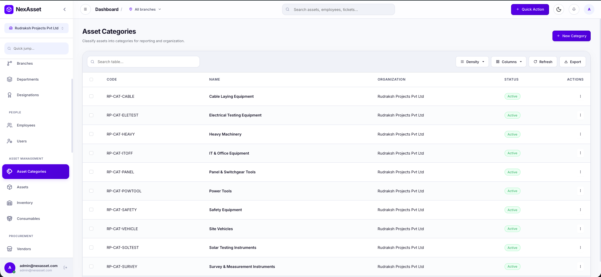
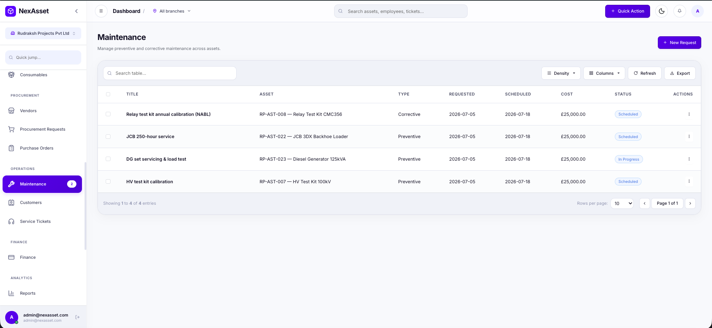
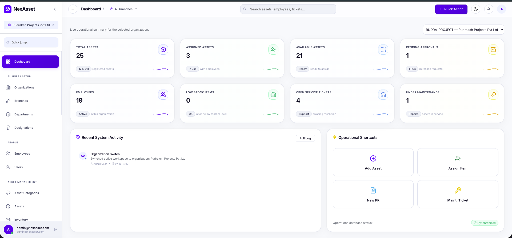
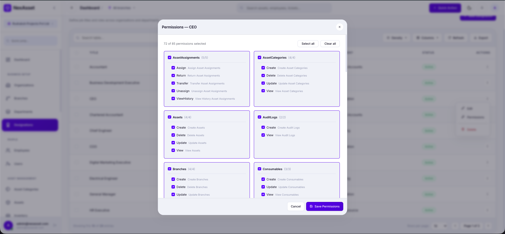

<!--
  NexAsset — Business Proposal & Product Overview
  Format: Markdown, optimized for conversion to DOCX / PDF (e.g. via Pandoc).
  Screenshot placeholders are clearly marked as blockquotes beginning with "SCREENSHOT PLACEHOLDER".
  Replace every {{ ... }} token before distribution.
  Conversion tips are in the final appendix.
-->

<div align="center">

# NexAsset

## Enterprise Asset Management Platform

### One unified system for Assets, Inventory, Procurement, Maintenance & Operations — built for asset-intensive enterprises.

<br>

**Business Proposal & Product Overview**

<br>

|  |  |
|---|---|
| **Prepared For** | {{ Stakeholder / Client / Investor Name }} |
| **Prepared By** | {{ Your Company Name }} |
| **Illustrative Deployment** | Rudraksh Projects Pvt Ltd |
| **Version** | 1.0 |
| **Date** | 19 July 2026 |
| **Classification** | Confidential — For Intended Recipient Only |

<br>

_This document is a business proposal and product overview. It is not a software requirement specification or technical manual._

</div>

---

## Table of Contents

1. Executive Summary
2. Industry Challenges
3. Why Existing Methods Fail
4. Introducing NexAsset
5. Core Modules
6. Employee Management
7. Asset Lifecycle Management
8. Inventory & Procurement
9. Maintenance Management
10. Reporting & Analytics
11. Security & Administration
12. Revenue Opportunity
13. Competitive Advantages
14. Current Progress
15. System Quality
16. Future Roadmap
17. Business Benefits
18. Conclusion
19. Appendix — Export & Conversion Notes

---

# 1. Executive Summary

Asset-intensive organizations — solar EPC firms, electrical contractors, O&M providers, and infrastructure companies — run on **equipment, inventory, and field operations**. Yet the majority still manage these critical resources through disconnected spreadsheets, WhatsApp messages, paper registers, and email chains. The result is predictable: assets go missing, inventory is over-ordered, maintenance slips, approvals stall, and leadership loses visibility across branches.

**NexAsset** is a centralized Enterprise Asset Management (EAM) platform that replaces this fragmented reality with a single, unified system. Every department — engineering, operations, procurement, maintenance, finance, and administration — works from the same real-time source of truth. From the moment an asset is purchased to the day it is retired, NexAsset tracks its category, location, ownership, movement, maintenance history, and value.

> **Key Insight**
> In field-driven businesses, an untracked ₹18-lakh cable-fault locator that sits idle in the wrong branch, or a preventive service that was never scheduled, costs far more than the software that would have prevented it. NexAsset converts scattered operational knowledge into structured, auditable, decision-ready information.

For a company like our illustrative client, **Rudraksh Projects Pvt Ltd** — a solar EPC and electrical contracting business operating a head office, four branches, nine departments, and hundreds of employees managing thousands of assets — NexAsset provides the operational backbone that scales with the business rather than breaking under it.

This document explains **why NexAsset exists, the industry problems it solves, how organizations benefit, how the solution works, why companies should adopt it, and where the platform is headed.**

---

# 2. Industry Challenges

Asset-intensive companies face a consistent set of operational problems. Individually, each is a nuisance; collectively, they erode margins, delay projects, and expose the business to compliance and audit risk.

| # | Challenge | Business Impact |
|---|-----------|-----------------|
| 1 | Asset Loss & Misplacement | Direct capital loss; expensive re-purchasing |
| 2 | Manual Spreadsheet Tracking | Errors, version conflicts, no single truth |
| 3 | Poor Inventory Visibility | Stock-outs on site; project delays |
| 4 | Duplicate Procurement | Unnecessary spend; working-capital drain |
| 5 | Preventive Maintenance Failures | Equipment breakdown; safety incidents |
| 6 | Approval Delays | Slow decisions; stalled site work |
| 7 | Lack of Audit Trails | Compliance exposure; disputes |
| 8 | No Asset Ownership Tracking | Accountability gaps; "who has it?" |
| 9 | No Warranty Tracking | Paid repairs on in-warranty equipment |
| 10 | Equipment Downtime | Lost billable hours; penalty clauses |
| 11 | Human Errors | Rework; misreported quantities |
| 12 | Poor Department Coordination | Siloed information; finger-pointing |
| 13 | No Branch-Level Visibility | Leadership flying blind across locations |

### 2.1 Asset Loss & Misplacement
High-value instruments — IV curve tracers, relay test kits, micro-ohmmeters — move constantly between sites, vehicles, and branches. Without a system of record, they are frequently misplaced, left at client sites, or simply forgotten. Each loss is a direct hit to capital and often triggers a duplicate purchase.

### 2.2 Manual Spreadsheet Tracking
Spreadsheets are the default fallback, but they were never designed for multi-user, multi-branch operations. Files fork into conflicting versions, formulas break, and there is no reliable "current" copy. The larger the organization, the more dangerous the spreadsheet becomes.

### 2.3 Poor Inventory Visibility
When project teams cannot see real stock levels of modules, cables, connectors, or panels, they either halt work waiting for material or hoard excess "just in case." Both outcomes hurt cash flow and project timelines.

### 2.4 Duplicate Procurement
Without a shared view of what is already in stock or on order, different teams and branches purchase the same items independently — inflating spend and tying up working capital in redundant inventory.

### 2.5 Preventive Maintenance Failures
Preventive service on generators, JCBs, and calibrated instruments is easy to postpone when it lives in someone's memory. Missed maintenance turns into corrective breakdowns — always more expensive and often at the worst possible moment on a live project.

### 2.6 Approval Delays
Purchase requests approved over phone calls and WhatsApp have no queue, no record, and no accountability. Requests get lost, urgent items wait, and no one can say where a decision is stuck.

### 2.7 Lack of Audit Trails
When something goes wrong — a missing asset, a disputed delivery, an unauthorized change — there is no reliable record of who did what and when. This is a serious liability during financial audits and client disputes.

### 2.8 No Asset Ownership Tracking
"Who currently has the total station?" is a question that should take seconds to answer. In most organizations it takes phone calls. Ownership and custody are invisible.

### 2.9 No Warranty Tracking
Equipment under warranty is routinely sent for paid repairs simply because no one knows the warranty status. The organization pays twice — once for the warranty it already owns, and again for the avoidable repair.

### 2.10 Equipment Downtime
Every hour a critical instrument or vehicle is down is an hour of lost billable field work — and, on contracts with penalty clauses, a direct financial hit.

### 2.11 Human Errors
Manual logs invite transcription mistakes, wrong quantities, and misfiled records. These small errors compound into large reconciliation problems at month-end.

### 2.12 Poor Department Coordination
Engineering, procurement, and finance each maintain their own version of the truth. The handoffs between them are where information — and accountability — falls through the cracks.

### 2.13 No Branch-Level Visibility
Leadership cannot compare or consolidate across Ahmedabad, Mumbai, Bangalore, and Noida when each branch keeps its own records. Strategic decisions are made on partial, stale information.

> **SCREENSHOT PLACEHOLDER — Industry Challenges Illustration (optional)**
> _Insert: The attached "industry challenges" reference graphic, or a professionally redrawn version._
> **What it demonstrates:** A single visual summary of the thirteen problems above, used as the section opener.

---

# 3. Why Existing Methods Fail

Most organizations are not managing assets badly on purpose — they are using tools that were never built for the job.

| Traditional Method | Why It Fails at Scale |
|--------------------|------------------------|
| **Excel Sheets** | No real-time sharing, no permissions, no history; breaks beyond a few hundred rows and multiple editors. |
| **WhatsApp** | Decisions and approvals vanish into chat scroll; nothing is searchable, structured, or auditable. |
| **Phone Calls** | Zero record; accountability depends on memory. |
| **Emails** | Information scattered across inboxes; no shared state; no workflow. |
| **Paper Registers** | Not searchable, easily lost or damaged, impossible to consolidate across branches. |
| **Manual Logs** | Error-prone, delayed, and disconnected from the rest of the business. |

The common thread is that these tools are **personal, not organizational**. They store information in individuals' devices and memories rather than in a shared, governed system. They cannot enforce a process, cannot restrict who sees what, cannot produce an audit trail, and cannot give leadership a consolidated view.

> **The Core Problem**
> These methods do not scale with the business. They work for a five-person operation and quietly fail for a five-branch enterprise — usually right at the moment growth makes the failure most costly.

---

# 4. Introducing NexAsset

**NexAsset is a centralized Enterprise Asset Management platform that unifies every asset-related activity of the organization into one governed system.**

Instead of each department maintaining its own records, every team works from a shared platform:

- **Engineering & Operations** manage assets, assignments, and field movements.
- **Procurement** raises requests, issues purchase orders, and manages vendors.
- **Maintenance teams** schedule preventive work and resolve breakdowns.
- **Finance** tracks asset value, procurement spend, and cost.
- **Administration** governs access, roles, and audit oversight.
- **Leadership** sees the whole picture — across every branch — in real time.

```
                        ┌─────────────────────────────┐
                        │          NexAsset            │
                        │   Single Source of Truth     │
                        └──────────────┬──────────────┘
                                       │
   ┌───────────┬───────────┬──────────┼──────────┬───────────┬───────────┐
   │           │           │          │          │           │           │
Engineering Operations Procurement Maintenance Finance   Admin    Leadership
   │           │           │          │          │           │           │
 Assets     Service     Vendors    Preventive   Asset     Roles &   Dashboards
 & moves    tickets     PR / PO    & repairs    value     access    & reports
```

Because every module shares the same data, an action in one place is instantly visible everywhere relevant. When procurement receives modules, inventory updates. When an asset is assigned to an engineer, ownership is recorded. When maintenance is scheduled, the asset's status reflects it. **One system, one truth, everyone aligned.**

---

# 5. Core Modules

NexAsset is organized as a suite of business modules that map directly to how an asset-intensive enterprise actually operates. Each is described below in plain business terms.

### Business Setup
| Module | What It Does for the Business |
|--------|-------------------------------|
| **Organization Management** | Defines the company as the top-level entity; the foundation every other record belongs to. |
| **Branch Management** | Models each operating location (e.g., Ahmedabad, Mumbai, Bangalore, Noida) so activity can be tracked and compared per branch. |
| **Department Management** | Structures the company into functional units — Engineering, Operations, Procurement, Finance, HR, and more. |
| **Designation Management** | Defines job titles and the level of access each role carries within the system. |

### People
| Module | What It Does for the Business |
|--------|-------------------------------|
| **Employee Management** | Central register of every employee — their branch, department, designation, and status. |
| **User & Role Management** | Controls who can log in, what they can see, and what they can do — the governance layer of the platform. |

### Asset Management
| Module | What It Does for the Business |
|--------|-------------------------------|
| **Asset Categories** | Classifies assets into meaningful groups — Solar Testing Instruments, Electrical Testing Equipment, Vehicles, Heavy Machinery, and so on. |
| **Asset Management** | The core register of every physical asset, its value, location, ownership, and current status. |
| **Inventory Management** | Tracks consumable stock — modules, cables, connectors, panels — with live quantities and reorder levels. |
| **Consumables** | Manages items that are drawn down and used up on projects, linked to inventory. |

### Procurement
| Module | What It Does for the Business |
|--------|-------------------------------|
| **Vendor Management** | A governed directory of approved suppliers and their details. |
| **Procurement (Purchase Requests)** | Structured, trackable requests to buy — with a clear approval trail. |
| **Purchase Orders** | Formal orders issued to vendors, linked back to the originating request. |

### Operations
| Module | What It Does for the Business |
|--------|-------------------------------|
| **Maintenance** | Plans preventive service and records corrective repairs, with cost and status. |
| **Customers** | Register of the clients the organization serves on projects and O&M contracts. |
| **Service Tickets** | Logs and tracks field issues and service requests through to resolution. |

### Finance & Insight
| Module | What It Does for the Business |
|--------|-------------------------------|
| **Finance** | Consolidates the financial dimension of assets and operations for the finance team. |
| **Reports** | Turns operational data into cross-branch business insight for leadership. |

### Governance
| Module | What It Does for the Business |
|--------|-------------------------------|
| **Administration** | Oversight tools and the audit record of significant actions. |
| **Roles & Permissions** | Fine-grained control over exactly what each designation and user can access. |
| **Notifications** | Keeps teams informed of the events that matter to them. |
| **Approval Center** | A single place for approvers to action pending requests. |
| **Settings** | Workspace and system configuration. |

> **Design Principle**
> Every module is intentionally simple to use. Complexity lives in the platform; simplicity is what the user experiences.

---

# 6. Employee Management

People are at the center of every asset movement — someone requests, approves, receives, uses, maintains, and returns each asset. NexAsset therefore treats employee management as a first-class capability, not an afterthought.

**What NexAsset manages for every employee:**

- **Employee Records** — a complete, structured profile for each person.
- **Departments & Designations** — where they sit in the organization and the authority their role carries.
- **Branch Assignment** — the location they operate from (or company-wide, for leadership such as CEO, COO, and Managing Director).
- **Role Assignment & User Accounts** — their secure login and exactly what they are permitted to do.
- **Status** — active, on notice, or inactive, keeping the register current.
- **Employee Lifecycle** — from onboarding through role changes to exit, with access adjusted accordingly.
- **Asset Allocation** — which assets are currently in the employee's custody.
- **Employee History** — a trail of assignments and activity over time.

> **Business Value**
> When an employee leaves or changes branches, NexAsset makes it immediate and obvious which assets must be recovered or reassigned — closing a gap where organizations routinely lose equipment.

> **SCREENSHOT PLACEHOLDER — Employees**
> _Insert: The Employees list screen showing employee records with branch, department, and designation columns._
> **What it demonstrates:** A clean, searchable register of the workforce with organizational structure at a glance.

---

# 7. Asset Lifecycle Management

The heart of NexAsset is its ability to track an asset through **its entire life** — not just a static list, but every event and movement from acquisition to retirement.

```
 Purchase ─▶ Inventory ─▶ Assignment ─▶ Transfer ─▶ Maintenance ─▶ Return ─▶ Disposal
     │            │            │            │             │            │          │
     └──────────────────────── Continuous History & Audit ───────────────────────┘
              (Ownership · Location · Warranty · Value tracked at every stage)
```

| Lifecycle Stage | What NexAsset Captures |
|-----------------|------------------------|
| **Purchase** | How and when the asset entered the organization, and at what cost. |
| **Inventory** | Where it is held before deployment. |
| **Assignment** | Which employee currently holds it, and since when. |
| **Transfer** | Every movement between employees, branches, or departments. |
| **Maintenance** | Preventive and corrective service events, with cost and outcome. |
| **Return** | When custody comes back to the organization. |
| **Disposal** | Retirement at end of useful life. |
| **History** | A complete, chronological record of the asset's journey. |
| **Audit** | A trustworthy trail of significant actions for compliance. |
| **Warranty** | Coverage awareness to avoid paying for repairs already covered. |
| **Location** | Where the asset is at any point in time. |
| **Ownership** | Clear, current accountability — no more "who has it?" |

> **Key Insight**
> Most systems answer "what do we own?" NexAsset answers the far more valuable questions: **"where is it, who has it, what has happened to it, and what is it worth now?"**



**Figure 1 — Asset Categories.** Every asset is classified into meaningful, industry-specific groups — Solar Testing Instruments, Electrical Testing Equipment, Cable Laying Equipment, Heavy Machinery, Panel & Switchgear Tools, and more — so the organization can report, analyse, and manage assets by type. Shown here for Rudraksh Projects Pvt Ltd.

---

# 8. Inventory & Procurement

For EPC and contracting businesses, materials **are** the project. Running out of DC cable or modules mid-installation is not an inconvenience — it is a stalled site and an unhappy client. NexAsset connects what you have with what you buy.

**Inventory & Stock**
- **Warehouses / Branch Stock** — stock is tracked per branch, so teams see what is actually available where they are.
- **Inventory** — live quantities of every stock item, with reorder levels that flag low stock before it becomes a shortage.
- **Consumables** — items drawn down on projects are linked to inventory so usage is visible.
- **Stock Visibility** — every stock movement (receipt, issue, adjustment) is recorded, keeping quantities accurate and trustworthy.

**Procurement**
- **Vendor Management** — a governed list of approved suppliers.
- **Purchase Requests** — structured requests that replace WhatsApp and phone calls with a trackable queue.
- **Purchase Orders** — formal orders linked to their originating request and vendor.
- **Approval Workflow** — requests move through a clear approval path, visible to everyone involved.

```
Purchase Request ─▶ Approval ─▶ Purchase Order ─▶ Vendor ─▶ Goods Received ─▶ Inventory Updated
      (raised          (decision    (issued          (fulfils    (stock-in            (live stock
      by team)         recorded)    to vendor)        order)      recorded)            reflects it)
```

> **Business Value**
> Because procurement and inventory share one system, NexAsset directly attacks **duplicate purchasing** and **stock-outs** — two of the most expensive, and most common, failures in field-driven businesses.

> **SCREENSHOT PLACEHOLDER — Inventory**
> _Insert: The Inventory screen showing stock items, current quantity, reorder level, and a low-stock indicator._
> **What it demonstrates:** Live, branch-level stock visibility with automatic low-stock flagging.

> **SCREENSHOT PLACEHOLDER — Procurement**
> _Insert: The Purchase Requests or Purchase Orders screen showing items moving through approval statuses._
> **What it demonstrates:** A structured, auditable procurement pipeline replacing informal approvals.

---

# 9. Maintenance Management

Uptime is revenue. Every generator, backhoe, vehicle, and calibrated instrument that is unexpectedly out of service is lost field capacity. NexAsset makes maintenance deliberate rather than reactive.

| Capability | What It Delivers |
|------------|------------------|
| **Preventive Maintenance** | Planned, scheduled servicing so equipment is maintained *before* it fails. |
| **Corrective Maintenance** | Structured logging and resolution of breakdowns when they occur. |
| **Ticketing** | Field issues and service requests captured, assigned, and tracked to closure. |
| **Service History** | A full maintenance record per asset — invaluable for reliability decisions and resale. |
| **Maintenance Costs** | Visibility of what each asset costs to keep running. |
| **Downtime Reduction** | Fewer surprise failures and faster resolution mean more billable field hours. |

> **Key Insight**
> A calibrated relay test kit that misses its annual calibration is not just a maintenance gap — it can invalidate test certificates and client acceptance. NexAsset ensures these obligations are scheduled and visible, not forgotten.



**Figure 2 — Maintenance Management.** Preventive and corrective maintenance tracked in one place and tied to specific assets — including NABL calibration of a relay test kit, a 250-hour JCB service, and a DG-set load test — each with type, requested and scheduled dates, cost, and live status (Scheduled / In Progress / Completed).

---

# 10. Reporting & Analytics

Data only creates value when it becomes insight. NexAsset turns day-to-day operational activity into information leadership can act on.

- **Dashboards** — at-a-glance operational health: total assets, assigned vs. available, pending approvals, low-stock items, open service tickets, and equipment under maintenance.
- **Reports** — consolidated views across branches, so leadership can compare performance and spot outliers.
- **Business Insights** — patterns that inform decisions: utilization, procurement trends, maintenance load.
- **Operational Analytics** — a factual basis for planning capacity, budgets, and resourcing.
- **Exporting** — information can be taken out of the system for board packs, audits, and client reporting.

> **Business Value**
> When leadership can see every branch on one screen, decisions get faster and better. NexAsset shortens the distance between "something is happening in the field" and "management knows and can act."



**Figure 3 — Executive Dashboard.** A single, real-time view of operational health: total, assigned, and available assets; pending approvals; active employees; low-stock items; open service tickets; and assets under maintenance — with an organization focus selector and recent-activity feed. This is the screen leadership opens first each morning.

> **SCREENSHOT PLACEHOLDER — Reports**
> _Insert: The Reports screen showing a cross-branch / cross-organization summary._
> **What it demonstrates:** Consolidated, comparable insight for leadership decision-making.

---

# 11. Security & Administration

Enterprise data demands enterprise governance. NexAsset is built so that the right people see the right information — and nothing more.

| Capability | What It Means for the Organization |
|------------|-------------------------------------|
| **Authentication** | Secure, individual logins — every action is tied to a real person. |
| **Authorization** | The system enforces what each user is allowed to do, not just what they can see. |
| **Role-Based Access** | Access is granted by job role, so a Site Engineer, a Procurement Manager, and a Finance Officer each see a workspace appropriate to their responsibilities. |
| **Permissions** | Fine-grained control over individual capabilities within every module. |
| **Audit Logs** | A record of significant actions, supporting compliance and dispute resolution. |
| **Administrative Controls** | Central governance of users, roles, and organization-wide settings. |
| **Branch/Organization Isolation** | Each organization's data is strictly separated; leadership can focus the entire system on one branch or view everything, while other users only ever see their own scope. |

> **Enterprise-Grade by Design**
> NexAsset is architected so that access control is enforced centrally and consistently — a user cannot reach data they are not entitled to, regardless of how they attempt to. Governance is a foundation of the platform, not a feature bolted on afterward.



**Figure 4 — Role-Based Permissions.** Access is defined at a fine-grained level for every role. Here the **CEO** designation is being granted specific capabilities — module by module, action by action (View, Create, Update, Delete, Assign, Transfer, and more) — so each person sees and does exactly what their responsibilities require, and nothing more. This is the governance layer that keeps enterprise data secure.

> **SCREENSHOT PLACEHOLDER — Approval Center**
> _Insert: The Approval Center showing pending requests awaiting an approver's decision._
> **What it demonstrates:** A single, accountable place where approvals happen and are recorded.

---

# 12. Revenue Opportunity

NexAsset is not only an internal efficiency tool — it is a **commercial product** with multiple, complementary revenue streams. The same platform that streamlines one company's operations can be sold, deployed, and supported across an entire industry.

| Revenue Stream | Description |
|----------------|-------------|
| **One-Time Licensing** | Perpetual license sold to a client for on-premise or dedicated deployment. |
| **Annual Maintenance Contracts (AMC)** | Recurring fee for updates, support, and platform upkeep. |
| **Cloud Subscription** | Predictable monthly/annual recurring revenue for hosted access. |
| **Enterprise SaaS** | Multi-tenant subscription model serving many organizations from one platform. |
| **Customization Services** | Paid tailoring to a client's specific workflows and terminology. |
| **Implementation Charges** | Onboarding, data migration, and configuration services. |
| **Training** | Paid enablement for client teams and administrators. |
| **Support** | Tiered support plans (standard / priority / premium). |
| **Consulting** | Advisory on asset-management best practice and process design. |

### Why EPC and Contracting Companies Need This
EPC, O&M, and electrical contracting firms are **among the most asset-intensive businesses that exist**, yet are historically **underserved by software** built for their reality. They own expensive, mobile, calibration-sensitive equipment; they run multiple simultaneous project sites; and they operate across branches. This combination makes the cost of *not* having a system unusually high — and the willingness to adopt a purpose-fit solution unusually strong. NexAsset is positioned precisely at this underserved, high-value intersection.

> **Commercial Insight**
> The strongest sales narrative is ROI, not features. For a firm losing even a handful of high-value instruments per year and over-ordering material across branches, NexAsset pays for itself well before the end of its first contract term.

---

# 13. Competitive Advantages

The most common alternative to NexAsset is not a rival product — it is **Excel and manual processes**. The comparison is decisive.

| Capability | Excel / Manual Methods | NexAsset |
|-----------|:----------------------:|:--------:|
| **Tracking** | Static rows, quickly outdated | Live, real-time asset & stock tracking |
| **Automation** | None — everything manual | Structured workflows across modules |
| **Audit** | No reliable trail | Recorded trail of significant actions |
| **Reporting** | Manual, error-prone, per-file | Consolidated, cross-branch insight |
| **Security** | Anyone with the file has everything | Role-based access & permissions |
| **Approvals** | Phone / chat, untracked | Structured approval workflow |
| **Maintenance** | Memory-based, often missed | Scheduled preventive & corrective service |
| **Scalability** | Breaks beyond a few users/branches | Built for multi-branch, multi-department scale |
| **Ownership Visibility** | "Who has it?" via phone calls | Instant custody & location answers |
| **Multi-Branch Consolidation** | Impossible without manual merging | Native, one-click across the organization |

> **The Bottom Line**
> Spreadsheets are personal tools pretending to be enterprise systems. NexAsset is an enterprise system — governed, connected, auditable, and built to grow with the organization.

---

# 14. Current Progress

NexAsset is not a concept — it is a **working, integrated platform** with its core modules already built and operating against live data. The following major modules are implemented and demonstrable.

> _Note: The screenshots below should show only the major modules — not every screen. Each placeholder indicates the intended image and what it proves._

### Implemented & Demonstrable
- **Dashboard** — live operational KPIs with organization focus.
- **Employees** — full workforce register with organizational structure.
- **Assets & Asset Categories** — complete asset register with categories, status, and ownership.
- **Inventory & Consumables** — live stock with reorder flagging and stock movements.
- **Vendors, Purchase Requests & Purchase Orders** — end-to-end procurement flow with approvals.
- **Maintenance** — preventive and corrective records tied to assets.
- **Customers & Service Tickets** — client register and field-issue tracking.
- **Reports** — consolidated cross-branch insight.
- **Administration & Audit** — governance and activity oversight.
- **Approval Center** — centralized pending approvals.
- **Roles, Permissions & Users** — role-based access, enforced organization-wide.
- **Settings** — workspace configuration.
- **Multi-branch, multi-department, role-scoped operation** — proven with a realistic solar-EPC dataset (branches, departments, designations, employees, assets, inventory, vendors, procurement, maintenance, and service tickets).

| Screenshot to Insert | What It Demonstrates |
|----------------------|----------------------|
| **Dashboard** | Executive operational overview with live KPIs |
| **Employees** | Structured workforce management |
| **Assets** | Live asset register with status & ownership |
| **Inventory** | Branch-level stock with low-stock alerts |
| **Procurement** | Structured request → approval → order flow |
| **Maintenance** | Preventive & corrective service tracking |
| **Reports** | Cross-branch consolidated insight |
| **Administration** | Governance & audit oversight |
| **Approval Center** | Accountable, centralized approvals |
| **Settings** | Workspace & system configuration |

> **SCREENSHOT PLACEHOLDER — Dashboard** · _Insert primary dashboard view._
> **SCREENSHOT PLACEHOLDER — Employees** · _Insert employee register._
> **SCREENSHOT PLACEHOLDER — Assets** · _Insert asset register._
> **SCREENSHOT PLACEHOLDER — Inventory** · _Insert inventory with low-stock indicator._
> **SCREENSHOT PLACEHOLDER — Procurement** · _Insert purchase requests/orders with statuses._
> **SCREENSHOT PLACEHOLDER — Maintenance** · _Insert maintenance records._
> **SCREENSHOT PLACEHOLDER — Reports** · _Insert consolidated report view._
> **SCREENSHOT PLACEHOLDER — Administration** · _Insert audit / governance screen._
> **SCREENSHOT PLACEHOLDER — Approval Center** · _Insert pending approvals._
> **SCREENSHOT PLACEHOLDER — Settings** · _Insert settings screen._

---

# 15. System Quality

Beneath the business capabilities, NexAsset is engineered to enterprise standards — so the organizations that depend on it can do so with confidence.

- **Built on a modern, industry-standard platform** — a mature, widely-adopted technology foundation trusted by large enterprises worldwide.
- **API-driven architecture** — the platform is designed for integration and future extension, not as a closed island.
- **Scalable architecture** — engineered to grow from a single office to a multi-branch enterprise.
- **Enterprise-grade practices** — consistent, disciplined engineering standards throughout.
- **High maintainability** — a clean, modular design that can evolve quickly as business needs change.
- **Secure authentication** — every user is individually and securely identified.
- **Role-based authorization** — access is governed centrally and enforced consistently.
- **Clean, modular design** — each business capability is a well-defined module, making the platform robust and extensible.

> **Why This Matters to Stakeholders**
> Quality is not visible on a screen, but it is felt in reliability, security, and the speed at which the product can adapt. NexAsset is built to be depended on and built to grow.

---

# 16. Future Roadmap

NexAsset today is a strong, working foundation. The roadmap extends it into a category-leading platform.

```
 PHASE 1 — Available Now        PHASE 2 — Near Term            PHASE 3 — Strategic
 ──────────────────────        ──────────────────────         ──────────────────────
 • Core EAM modules            • Native Android App           • Multi-Tenant SaaS
 • Role-based access           • Native iOS App               • Cloud Deployment
 • Multi-branch operation      • Advanced Analytics           • AI Asset Assistant
 • Procurement & Maintenance   • Business Intelligence         • Predictive Maintenance
 • Reports & Dashboards          Dashboards                   • RFID Asset Tracking
                               • Project Management            • IoT Device Integration
                               • Task Management
                               • Project Resource Allocation
                               • Employee Project Assignment
```

**Planned Enhancements**

| Theme | Planned Capability |
|-------|--------------------|
| **Intelligence** | AI Asset Assistant · Predictive Maintenance · Advanced Analytics · Business Intelligence Dashboard |
| **Connected Assets** | RFID Asset Tracking · IoT Device Integration |
| **Mobility** | Native Android Application · Native iOS Application |
| **Platform** | Multi-Tenant SaaS Platform · Cloud Deployment |
| **Project Delivery** | Project Management · Project Resource Allocation · Task Management · Employee Project Assignment |

> **Vision**
> From tracking assets, to *predicting* their needs; from recording work, to *orchestrating* entire projects. NexAsset's roadmap moves the organization from reactive to proactive to predictive.

_All roadmap items are planned future enhancements and are presented for direction, not as committed delivery dates._

---

# 17. Business Benefits

NexAsset delivers measurable value across the organization. The figures below are **illustrative industry-oriented targets**, not guarantees — actual results depend on the organization's baseline and adoption.

| Benefit | Business Outcome |
|---------|------------------|
| **Reduced Asset Loss** | Custody and location tracking sharply cut misplaced and unrecovered equipment. |
| **Reduced Procurement Cost** | Shared visibility eliminates duplicate purchasing and over-ordering. |
| **Higher Asset Utilization** | Idle assets become visible and redeployable across branches. |
| **Lower Downtime** | Preventive maintenance reduces surprise failures and lost field hours. |
| **Improved Compliance** | Audit trails and structured records strengthen audit readiness. |
| **Improved Productivity** | Less time spent chasing information; more time on billable work. |
| **Centralized Operations** | One system replaces a dozen spreadsheets and chat threads. |
| **Faster Decision-Making** | Live dashboards put leadership hours (not weeks) ahead. |
| **Better Audit Readiness** | Records are complete, structured, and instantly retrievable. |
| **Higher ROI** | Prevented losses and efficiency gains typically exceed platform cost early. |

> **Summary Card — The NexAsset Payoff**
> ▪ Fewer lost assets ▪ Lower material spend ▪ Higher uptime ▪ Faster approvals ▪ Cleaner audits ▪ Clearer leadership visibility — **all from one unified platform.**

---

# 18. Conclusion

Asset-intensive organizations do not fail for lack of effort — they lose money and momentum for lack of a system. Spreadsheets, chat messages, and paper registers cannot keep pace with a business that operates across branches, runs multiple project sites, and owns thousands of high-value, mobile assets.

**NexAsset closes that gap.** It brings every department onto one governed platform, tracks every asset through its entire life, connects procurement to inventory, makes maintenance deliberate, and gives leadership a single, real-time view of the whole organization. It replaces guesswork with facts, informal approvals with accountable workflows, and scattered records with an auditable source of truth.

For a company like **Rudraksh Projects Pvt Ltd** — and for the wider universe of solar EPC, electrical, O&M, and infrastructure firms — NexAsset is not merely software. It is the operational backbone that protects capital, improves utilization, reduces downtime, and scales confidently with growth. And with a roadmap extending into mobile, cloud, AI, and full project management, adopting NexAsset is an investment in a platform that will keep delivering value for years.

> **The Decision**
> The question is not whether asset-intensive organizations need a system like NexAsset — the daily cost of not having one already proves they do. The question is simply **how soon** they choose to capture the value.

<div align="center">

**NexAsset — Enterprise Asset Management Platform**

_Track everything. Lose nothing. Decide faster._

**Contact:** {{ Your Name }} · {{ Email }} · {{ Phone }} · {{ Company }}

</div>

---

# 19. Appendix — Export & Conversion Notes

_This appendix is for the document producer and can be removed before distribution._

**Recommended conversion (Markdown → DOCX):**
```
pandoc NexAsset-Business-Proposal.md -o NexAsset-Proposal.docx --toc
```

**Recommended conversion (Markdown → PDF):**
```
pandoc NexAsset-Business-Proposal.md -o NexAsset-Proposal.pdf --toc --pdf-engine=xelatex
```

**Producer checklist before sending:**
- Replace every `{{ ... }}` placeholder (recipient, your company, contact details).
- Insert each image at its **SCREENSHOT PLACEHOLDER** marker and delete the marker text.
- Apply a corporate template / reference doc for fonts, colors, and cover styling
  (`--reference-doc=your-template.docx` for DOCX).
- Optionally set each top-level heading to start on a new page in your template for a premium, chaptered feel.
- Add page numbers and a running header/footer in the final template.
